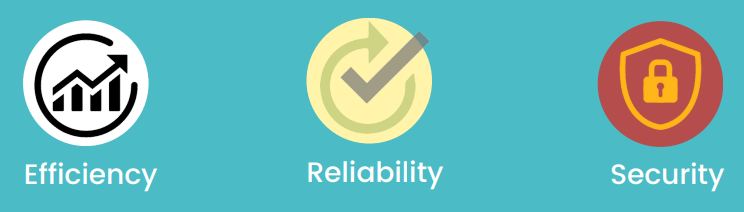
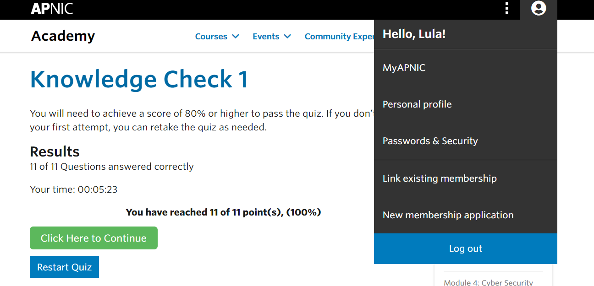

## Cover

<h3 align="center">
    <b>Kemanan Jaringan</b> 
    Resume - Module 1
</h3>
 

  

 

    Dosen Pembimbing: 
    Ferry Astika Saputra, S.T., M.Sc.

 

    Disusun Oleh: 
    Lula Rania Salsabilla (3122640045)

 

    <b>
        KELAS D4 LJ IT B  
        JURUSAN D4 LJ TEKNIK INFORMATIKA  
        DEPARTEMEN TEKNIK INFORMATIKA DAN KOMPUTER   
        POLITEKNIK ELEKTRONIKA NEGERI SURABAYA  
        2023
    </b>

 

## **Resume Bab 1**

### **Tujuan Pembelajaran**
- Memahami konsep dasar keamanan siber.
- Memahami tujuan dan prinsip keamanan utama. oMemahami apa yang perlu dilindungi.

### **System Interdependencies**
Internet dapat dilihat sebagai global yang besar, yang terdiri daribanyak sistem dan jaringan yang terpisah. 
Sistem atau jaringan yang terpisah biasanya dapat bekerja sama menggunakan protokol umum. Dengan bekerja sama dan saling ketergantungan ini cenderung menimbulkan beberapa risiko.

### **Value of Data and Information**
Pada tingkat yang paling dasar, data dan informasi sangat berharga bagi organisasi yang disebut sebagai aset untuk bisnis.

Data dan Informasi
- Laporan Internal                                             
- Data Transaksi                                                 
- Informasi Pengguna                                        
- Desain Produk atau Secret Recipe  

Ancaman Data dan Informasi                                       
- Modifikasi yang Tidak Sah                                  
- Akses yang Tidak Berhak                                
- Kehilangan Informasi                                               

### **Kebutuhan untuk Mengamankan**
Data dan informasi bisa dalam keadaan diam, digunakan atau bergerak.

- Data at Rest
Data tidak aktif disimpan secara fisik dalam database, data warehouse, spreadsheet, arsip, tape, off-site backup, dll.

- Data in Motion
Data yang melintasi jaringan atau sementara berada di memori komputer untuk dibaca atau diperbarui.

### **Apa Tujuan Utama Keamanan**
Tujuan utama dari keamanan informasi adalah menjaga kerahasiaan, integritas, dan ketersediaan (CIA) aset dan sistem informasi.

- Confidentiality
Properti bahwa informasi tidak tersedia atau diungkapkan kepada individu, entitas, atau proses yang tidak sah.
 
- Integrity
Properti untuk menjaga keakuratan dan kelengkapan aset.

- Availability
Properti yang dapat diakses dan digunakan sesuai permintaan oleh entitas yang berwenang tanpa penundaan.

### **Menempatkan CIA Dalam Konteks**
Perusahaan XYZ memiliki webmail bagi karyawan untuk mengakses akun email mereka. Terkadang mereka berbagi laporan dan berkomunikasi dengan pelanggan. Berdasarkan skenarionya, berikut adalah beberapa contoh yang mewakili konteks CIA.

- Confidentiality (kerahasiaan)
Username dan password untuk mengakses email web hanya boleh diketahui oleh pengguna. Isi komunikasi email hanya boleh tersedia bagi penerima yang dituju.

- Integrity (integritas)
Email yang diterima atau dikirim tidak diubah dari bentuk aslinya.

- Availability (ketersediaan)
Karena komunikasi email sangat penting bagi perusahaan, layanan email ini harus tersedia setiap saat.

### **Threat, Vulnerability, and Risk**
Dimensi lain yang harus kita pahami adalah hubungan Ancaman, Kerentanan, Risiko dengan konteks melindungi aset informasi kita.

- Threat
Sebuah potensi yang menyebabkan sesuatu yang tidak diinginkan terjadi pada sistem atau organisasi. Berikut kategori threat :

1. Natural Threats
Contohnya : gempa bumi, tornado, banjir, dll.

2. Enviromental Threats
Contohnya : polusi, reaaksi kimia, radiasi, dll.

3. Human Threats
Kegiatan yang dilakukan oleh manusia secara tidak sengaja atau disengaja seperti menyerang jaringan, mengunggah sesuatu yang berbahaya dll.

- Vulnerability
Kelemahan dalam prosedur keamanan sistem, desain, implementasi atau pengendalian internal yang dapat dilakukan (secara tidak sengaja dipicu atau sengaja dieksploitasi) dan mengakibatkan pelanggaran keamanan atau pelanggaran kebijakan keamanan sistem.

- Risk
Kemungkinan sumber ancaman tertentu terhadap kerentanan potensial dan dampak yang dihasilkan dari peristiwa buruk itu pada organisasi.

### **Security Control**
Tindakan pencegahan yang diberlakukan organisasi untuk melindungi aset informasi.

Policy and Procedures
Tujuan : Agar semuanya memperhatikan tentang keamanan, membagi peran dan tanggung jawab , mengamati masalah.
Contoh : Cyber Security Policy

Incident Handling Procedure
- Technical
Tujuan : Untuk mencegah dan mendeteksi potensi serangan, mengurangi risiko pelanggaran pada lapisan jaringan atau sistem.
Contoh :
- Firewall
- Anti Virus Software

- Physical
Tujuan : Untuk mencegah pencurian fisik aset informasi atau akses fisik yang tidak sah.
Contoh :
- CCTV
- Locks

### **Security Principle**
Seperti yang dapat kita lihat, ada berbagai jenis kontrol keamanan yang harus dilaksanakan berdasarkan penilaian risiko kita, kontrol keamanan harus bekerja sama untuk mencapai tujuan keamanan kita.

Dalam hal ini, ada dua prinsip keamanan yang sangat userful untuk diingat :
1. Principle the weakest link
Principle the weakest Link pada dasarnya berarti bahwa penyerang akan menemukan cara termudah untuk mencapai tujuan mereka. misalnya, mungkin lebih mudah untuk menebak kata sandi atau menipu karyawan untuk membagikan kata sandinya daripada mencoba memecahkan sesi jaringan terenkripsi.

2. Principle of least village
Principle of least village berarti entitas (orang, program, atau sistem) harus dapat mengakses hanya informasi dan sumber daya yang diperlukan untuk kebutuhan bisnisnya. prinsip ini penting untuk membatasi kerusakan atau dampak pelanggaran dan diterapkan pada kontrol keamanan.
Misalnya :
- pengguna pada sistem hanya membutuhkan hak istimewa bagi diri mereka sendiri untuk menyelesaikan tugas-tugas mereka.
- jika akun pengguna telah disusupi, maka penyerang hanya memiliki akses ke aset informasi yang dapat diakses oleh pengguna tersebut.

### **Hasil Quiz APNIC Module - 1**

### **Perbandingan Web Server**

Nginx dan Apache merupakan sebuah server web populer yang mana digunakan untuk mengirimkan halaman web ke browser pengguna. Apache dirilis pertama kali pada tahun 1995, kemudian muncul Nginx pada tahun 2004. Pangsa pasar Nginx terus berkembang selama bertahun-tahun. Dalam beberapa kasus, Nginx memiliki keunggulan kompetitif dalam hal kinerja. IIS merupakan singkatan dari Internet Information Server. IIS adalah sebuah HTTP server yang digunakan pada server dengan OS windows. IIS pertama kali dirilis sebagai addon dari layanan berbasis internet yang terdapat pada Windows NT 3.51.

- Apache berjalan di semua sistem mirip Unix seperti Linux, BSD, dll. Serta support dengan Windows. 
- Nginx berjalan pada sistem seperti Unix modern; namun support terbatas untuk Windows.	
- IIS berjalan pada sistem Windows untuk melayani halaman atau file HTML yang diminta. Server web IIS menerima permintaan dari komputer klien secara jarak jauh dan mengembalikan respons yang sesuai.

- Apache menggunakan pendekatan multi-utas untuk memproses permintaan klien.	
- Nginx mengikuti pendekatan berbasis peristiwa untuk melayani permintaan klien. 
- IIS -> Permintaan biasanya diproses berdasarkan basis permintaan dan respons sederhana. DNS Stuff mencontohkan, klien mengirimkan permintaan, kemudian respons dikirim.

- Apache tidak dapat menangani banyak permintaan secara bersamaan dengan lalu lintas web yang padat.	
- Nginx dapat menangani banyak permintaan klien secara bersamaan dan efisien dengan sumber daya perangkat keras yang terbatas.	
- Server Microsoft IIS menyediakan modul Penyaringan Permintaan untuk memindai dan memfilter permintaan klien yang berpotensi berbahaya.

- Apache di desain menjadi web server.		
- Nginx di desain menjadi web server dan proxy server.	
- IIS aplikasi web berbasis Windows Server yang digunakan untuk mengirimkan konten situs web melalui internet ke pengguna akhir.

- Performa Apache untuk konten statis lebih rendah dari Nginx.	
- Nginx dapat secara bersamaan menjalankan ribuan koneksi konten statis dua kali lebih cepat dari Apache dan menggunakan lebih sedikit memori.	
- IIS -> Pada saat browser meminta data web page ke server maka instruksi permintaan data oleh browser tersebut akan di kemas di dalam TCP yg merupakan protocol transport dan dikirim ke alamat yg dalam hal ini merupakan protocol berikutnya yaitu Hyper Text Transfer Protocol (HTTP).

- Satu utas hanya dapat memproses satu koneksi.	
- Satu utas dapat menangani banyak koneksi.	
- Memerlukan resource server yang cukup besar untuk menggunakannya.

**Kesimpulan**

Jika membutuhkan sebuah web server yang open source dapat diandalkan dapat menggunakan Apache, nginx, lighttpd, dan beberapa web server open source lainnya. Namun dari ketiga webserver open source diatas, nginx merupakan web server yang paling unggul dibidang penggunaan resource memory dan penanganan permintaan per detik. Sedangkan apabila web server apache lebih unggul di bagian patchnya yang lebih update dibandingkan kedua web server nginx dan IIS. Namun apabila kebutuhan kita dalam pembuatan web site menggunakan .net hanya ada IIS yang mampu digunakan untuk menjalankannya. Tapi kelemahannya web server ini bukan termasuk open source, namun web server IIS dapat supportnya Windows.
