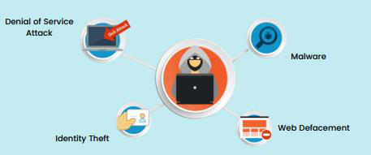
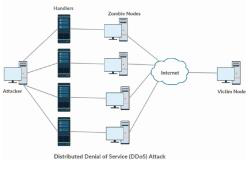
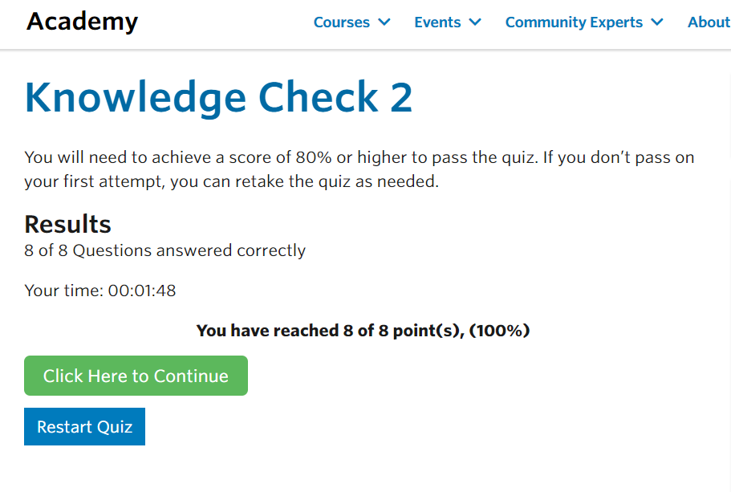

## Cover

<h3 align="center">
    <b>Kemanan Jaringan</b> 
    Resume - Module 2
</h3>
 

  

 

    Dosen Pembimbing: 
    Ferry Astika Saputra, S.T., M.Sc.

 

    Disusun Oleh: 
    Lula Rania Salsabilla (3122640045)

 

    <b>
        KELAS D4 LJ IT B  
        JURUSAN D4 LJ TEKNIK INFORMATIKA  
        DEPARTEMEN TEKNIK INFORMATIKA DAN KOMPUTER   
        POLITEKNIK ELEKTRONIKA NEGERI SURABAYA  
        2023
    </b>

 

## Resume Bab 2

> - **Tujuan Pembelajaran**
> - Memahami dampak insiden keamanan terhadap organisasi.
> - Memahami hubungan antara keamanan dan manajemen risiko.
> - Ketahui beberapa ancaman keamanan umum yang harus dihadapi organisasi.
>
> - **Mengapa Organisasi Membutuhkan Keamanan?**
> Kami belajar di Modul 1 bahwa organisasi perlu melindungi aset informasi mereka. 
> - Alasan utamanya adalah : Ancaman yang mengeksploitasi kerentanan dapat merugikan atau mengganggu aktivitas bisnis.
> - Hal ini dipresepsikan : Untuk menghadapi risiko kebakaran, organisasi menempatkan detektor asap dan alarm kebakaran di lokasi strategis, melakukan latihan kebakaran secara teratur, dan membeli asuransi.
> - Demikian pula, organisasi harus mengidentifikasi risiko keamanan dan mengelolanya.

> - **Beberapa Jenis Dampak Bisnis**
> Insiden keamanan dapat berdampak pada bisnis dalam beberapa cara :

> - Server database sedang down karena serangan Distributed Denial of Services (DDoS). > Operasi bisnis terganggu 
> karena masalah yang berkaitan dengan pemasok, kerusakan infrastruktur, dll
> - Jam ekstra diperlukan untuk pulih dari infeksi malware massal > Biaya melakukan bisnis meningkat.
> - Bisnis didenda oleh otoritas lokal karena pelanggaran informasi pelanggan > Tidak dapat memberikan layanan 
> berdasarkan kontrak, atau tidak mampu mematuhi peraturan.
> - Insiden keamanan menyebabkan pelanggan merasa bahwa organisasi tidak serius dalam melindungi informasi pelanggan > Citra atau merek organisasi terpengaruh.

> **Mengelola Resiko**
> Organisasi harus mengidentifikasi dan mengelola risiko yang dapat
> mengganggu aktivitas mereka setelah risiko diidentifikasi dan dinilai berdasarkan
> kemungkinannya, organisasi dapat memilih untuk: 
>
> - Mitigasi -> mitigasi atau mengurangi risiko dengan menerapkan kontrol
> keamanan 
>
> - Transfer -> mentransfer risiko sehingga ditangani oleh
> entitas lain
>
> Karena sifat dinamis dari lingkungan tempat organisasi beroperasi,
> penilaian risiko harus dilakukan secara teratur.
>
> **Meningkatkan Kesiapsiagaan Cyber Security**
> Bagaimana meningkatkan kesiap-siagaan keamanan siber?
>
> - Menyadari Risiko
> Menyadari tingkat dan kemungkinan risiko memungkinkan organisasi untuk
> lebih proaktif dan siap.
>
> - Pendekatan Komprehensif
> Pendekatan komprehensif untuk manajemen risiko harus melibatkan
> orang-orang di seluruh organisasi untuk meningkatkan kualitas
> pengambilan keputusan untuk mengelola risiko.
>
> - Manajemen Organisasi
> Manajemen puncak organisasi bertanggung jawab untuk memastikan
> keamanan atau organisasi.
>
> - Menginvestigasi Sumber Daya
> Upaya ini akan membutuhkan organisasi untuk menginvestasikan sumber
> daya (yaitu uang, waktu, dan personel) dan mengembangkan program
> keamanan cyber yang komprehensif.
>
> **Ancaman Keamanan Umum untuk Organisasi**
>
> 
>
> - Denial of Service Attack
> Pada dasarnya, serangan Ddos dilakukan melalui jaringan. 

> 
>
> Salah satu tekniknya adalah dengan mengirimkan banyak paket jaringan,
> lebih dari apa yang dapat diproses oleh server atau peralatan
> jaringan. Organisasi yang memiliki layanan yang menghadap internet
> seperti situs web, DNS, dan server email, rentan terhadap serangan
> ini.
>
> - Malicious Software
> Pengguna komputer biasanya tertipu untuk mengeksekusi malware. atau,
> penulis malware mengeksploitasi kerentanan perangkat lunak yang ada.
> Setelah dieksekusi pada sistem, ia akan melakukan aksinya.
>
> Apa yang dilakukan cracker ?
>
> - Merekam kegiatan users.
>
> Mengirim informasi (isi file atau database) 
> - Mengenkripsi file lokal dan memaksa untuk membuka enkripsi uang.
>
> Beberapa contoh dari malware
>
> - virus
> - worms
> - rootkits
> - backdors
> - trojan
>
> - Identity Theft
> Akses ke sistem biasanya didefinisikan berdasarkan identitas atau
> kredensial seperti nama dan kata sandi. Pencurian identitas terjadi
> ketika penyerang mencuri identitas pengguna sehingga mereka dapat
> meniru pengguna dan mendapatkan akses ke sistem.
>
> Cara melakukan serangan pencurian identitas :
> - Phissing
> Menipu pengguna untuk memberikan kredensial login mereka.
>
> - Malware
> Menginstal malware (keylogger) pada sistem pengguna untuk mencuri kredensial login
>
> - Web Defacement
> Organisasi memiliki situs web untuk memberikan informasi dan system.
> Perusakan web terjadi ketika konten situs web dimodifikasi oleh
> penyerang. Hal ini dapat terjadi karena kerentanan dalam perangkat
> lunak server web atau sistem manajemen konten. Hal ini dapat
> menyebabkan tidak tersedianya layanan atau dapat merusak reputasi
> organisasi.
>
> - **Cara Mengurangi Risiko Serangan Cyber**
> Dikatakan bahwa dalam keamanan, tidak ada satu solusi tunggal yang
> dapat mencegah atau membuat hilangnya masalah keamanan. Untuk
> menangani risiko yang disebutkan sebelumnya, kita harus menerapkan
> kontrol di berbagai tingkatan.
>
> - Kontrol teknis untuk mendeteksi dan mencegah (firewall, filter
> spam, sistem deteksi intrusi dan perangkat lunak antivirus).
> - Pendidikan dan pelatihan karyawan kami (terutama ketika berhadapan
> dengan phishing dan cara mengembangkan aplikasi web dengan aman).
> - Memastikan bahwa penyedia jaringan memiliki kemampuan untuk
> mendukung kami ketika kami diserang.

## Hasil Quiz APNIC Module -2

