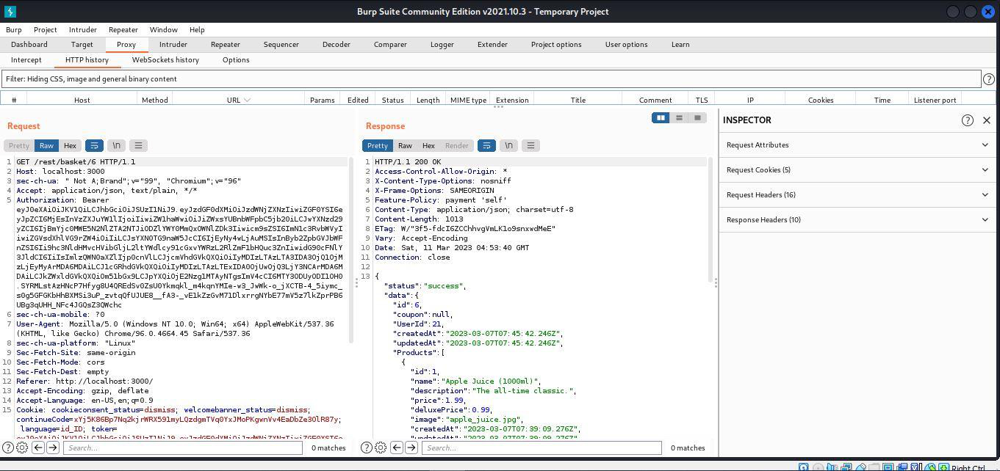

## Cover

<h3 align="center">
    <b>Praktikum Kemanan Jaringan</b> 
    A1 - Broken Access Control (OWASP 10 Juice Shop)
</h3>
 

  

 

    Dosen Pembimbing: 
    Ferry Astika Saputra, S.T., M.Sc.

 

    Disusun Oleh: 
    Lula Rania Salsabilla (3122640045)

 

    <b>
        KELAS D4 LJ IT B  
        JURUSAN D4 LJ TEKNIK INFORMATIKA  
        DEPARTEMEN TEKNIK INFORMATIKA DAN KOMPUTER   
        POLITEKNIK ELEKTRONIKA NEGERI SURABAYA  
        2023
    </b>

 

## Broken Access Control

### Informasi Dasar
### Deskripsi : 
Penyerang dan peretas dapat mengakses sebuah sistem ketika autentikasi dan pembatasan akses tidak diterapkan dengan baik. Dengan kata lain, Broken Access Control memungkinkan entri yang tidak sah yang dapat mengakibatkan kerentanan data dan file yang bersifat sensitif. Kontrol akses yang lemah terkait manajemen kredensial dapat dihindari dengan metode coding yang unik dan tindakan khusus seperti mematikan akun administratif dan penggunaan autentikasi multi-faktor.

### Target Serangan : 
Semua jenis Web Server, application server, dan web application rentan dan mudah untuk terkena beberapa permasalahan ini. Bahkan website yang hanya bersifat statis, jika tidak diatur dengan baik, dapat diretas oleh hacker, seperti akses terhadap file - file penting, deface, ataupun beberapa perbuatan merusak lainnya. 

### Bagaimana cara mengetahui keamanan Access Control : 
Semua website dipastikan membutuhkan access control. Oleh karena itu aturan dan desain nya sendiri harus secara jelas dan terdokumentasi. Jika tidak ada dokumentasi hampir dipastikan, website tersebut kemungkinan besar rentan. Code yang digunakan harus terstruktur, modular, dan sebagian besar terpusat. Review secara mendetail terhadap code harus dilakukan untuk memvalidasi keabsahan dari implementasi Access Control. Selain itu melakukan test dengan cara membobol code yang digunakan juga akan sangat membantu mengetahui ada atau tidaknya permasalahan pada Access Control.

**Broken Access Control**

> •**Informasi Dasar**\
> **Deskripsi :** Penyerang dan peretas dapat mengakses sebuah sistem
> ketika autentikasi dan pembatasan akses tidak diterapkan dengan baik.
> Dengan kata lain, Broken Access Control memungkinkan entri yang tidak
> sah yang dapat mengakibatkan kerentanan data dan file yang bersifat
> sensitif. Kontrol akses yang lemah terkait manajemen kredensial dapat
> dihindari dengan metode coding yang unik dan tindakan khusus seperti
> mematikan akun administratif dan penggunaan autentikasi multi-faktor.
>
> **Target Serangan :** Semua jenis Web Server, application server, dan
> web application rentan dan mudah untuk terkena beberapa permasalahan
> ini. Bahkan website yang hanya bersifat statis, jika tidak diatur
> dengan baik, dapat diretas oleh hacker, seperti akses terhadap file -
> file penting, deface, ataupun beberapa perbuatan merusak lainnya.
>
> **Bagaimana cara mengetahui keamanan Access Control :** Semua website
> dipastikan membutuhkan access control. Oleh karena itu aturan dan
> desain nya sendiri harus secara jelas dan terdokumentasi. Jika tidak
> ada dokumentasi hampir dipastikan, website tersebut kemungkinan besar
> rentan. Code yang digunakan harus terstruktur, modular, dan sebagian
> besar terpusat. Review secara mendetail terhadap code harus dilakukan
> untuk memvalidasi keabsahan dari implementasi Access Control. Selain
> itu melakukan test dengan cara membobol code yang digunakan juga akan
> sangat membantu mengetahui ada atau tidaknya permasalahan pada Access
> Control.
>
> •**Percobaan : Mengubah Isi Keranjang User**

+-----------------------------------+-----------------------------------+
| \-                                | > Setelah melakukan pengaksesan   |
|                                   | > localhost 3000 di terminal dan  |
|                                   | > mempersiapkan aplikasi          |
|                                   | > burpsuite di sini, saya         |
|                                   | > melakukan login dengan          |
|                                   | > menggunakan akun yang sudah di  |
|                                   | > daftarkan sebelumnya.           |
+===================================+===================================+
+-----------------------------------+-----------------------------------+

> {width="5.843055555555556in"
> height="3.1180555555555554in"}
>
> \- Kemudian setelah melakukan proses login disini akan di arahkan ke
> halaman dashboard untuk dapat memilih beberapa item dan nantinya akan disimpan ke
> keranjang.
>
> {width="6.268054461942257in"
> height="3.3361111111111112in"}
>
> \- Kemudian menuju halaman keranjang untuk dapat melihat yang telah
> ditambahkan yaitu aple juice dan apple pomance masing masing 1 buah.
>
> {width="6.268054461942257in"
> height="3.3402777777777777in"}
>
> \- Kemudian disini saya membuka halaman proxy di dalam http history
> untuk melihat track http history. Terdapat informasi host, method,
> url, status, length dan informasi pendukung lainnya.
>
> {width="6.268054461942257in"
> height="4.252777777777778in"}
>
> \- Kemudian setelah itu saya pilih http history yang memiliki params
> json dengan get /rest/basket/6. Kemudian saya lihat mengenai request
> dan response yang tertampil di halaman tersebut. Dimana response
> berisi informasi isi keranjang yang telah saya pilih sebelumnya.
>
> {width="6.268054461942257in"
> height="2.9569433508311462in"}
>
> \- Kemudian saya pindahkan list request yang saya amati sebelumnya
> menuju repeater, kemudian saya send dan pada response terlihat data
> keranjang yang sudah sesuai dengan apa yang diinputkan sebelumnya.
>
> {width="5.881944444444445in"
> height="2.7416666666666667in"}
>
> {width="6.268054461942257in"
> height="3.3541666666666665in"}
>
> \- Setelah melihat informasi response di repeater, saya mencoba untuk
> mengganti data id 6 menjadi 2 untuk melihat apakah terdapat perubahan
> yang ditampilkan response. Dan ternyata response membrikan informasi
> berbeda dari sebelumnya yang mana ternyata menunjukkan isi keranjang
> id 2.
>
> {width="6.268054461942257in"
> height="3.3361111111111112in"}
>
> \- Kemudian disini saya akan menggunakan fitur interceot untuk
> menampilkan data keranjang user lain di dalam website owasp juice
> shop. Dimana saya merubah status intercept yang tadinya off menjadi
> on.
>
> {width="6.268054461942257in"
> height="3.4819444444444443in"}
>
> \- Ketika intercept on disini terdapat baris informasi request terkait
> owasp juice shop. Kemudian saya foorward data tersebut hingga
> menemukan data get /rest/basket/6, kemudian saya ganti data uiidnya
> dengan id lain selain id 6 kemudian saya forward kembali informasi
> tersebut.
>
> {width="6.268054461942257in"
> height="2.9499989063867016in"}
>
> \- Website berhasil menampilkan isi keranjang pengguna lainnya berikut
> adalah isi keranjang pengguna : id (2).
>
> {width="6.268054461942257in"
> height="3.3541666666666665in"}
>
> \- Website berhasil menampilkan isi keranjang pengguna lainnya berikut
> adalah isi keranjang pengguna : id (4).
>
> {width="6.268054461942257in"
> height="3.345833333333333in"}
>
> \- Website berhasil menampilkan isi keranjang pengguna lainnya berikut
> adalah isi keranjang pengguna : id (5).
>
> {width="6.268054461942257in"
> height="3.3361111111111112in"}
>
> \- Disini saya sudah berhasil untuk melakukan challenge melihat
> keranjang orang lain.
>
> {width="6.268054461942257in"
> height="0.8722222222222222in"}
>
> •**Percobaan : Login Admin**\
> - Disini saya bermaksud ingin mencari data email, yang mana ditemukan
> di komentar ulasan. Dimana ada informasi email admin disana.
>
> {width="6.268054461942257in"
> height="3.138888888888889in"}
>
> \- Kemudian saya melakukan login dengan menggunakan password dummy,
> namun sebelumnya saya melakukan perubahan status menjadi on di intercept.
>
> {width="6.268055555555556in"
> height="3.345833333333333in"}
>
> \- Ketika melakukan submit login, intercept memberikan informasi
> berupa baris informasi yang mana memuat email dan password.
>
> \- Kemudian setelah melihat informasi tersebut, saya menggunakan ikon
> yang dikotaki warna merah untuk melakukan pengiriman menuju intruder, positions.
>
> {width="6.268055555555556in"
> height="3.341665573053368in"}
>
> \- Kemudian kita berpindah ke halaman intruder, positions dan melihat
> data informasi yang ada disana, kemudian klik clear. 
> Ada penambahan beberapa data ketika proses melakukan clear data.
>
> {width="6.268055555555556in"
> height="3.3361111111111112in"}
>
> \- Kemudian klik add, yang mana dalam hal ini akan membuat data email
> memiliki tambahan sign dollar didepannya. Hal ini membuat adanya
> perubahan yang ada.
>
> {width="6.268055555555556in"
> height="3.345833333333333in"}
>
> \- Proses berikutnya saya menuju ke payloads dan melakukan load data
> file password.txt yang sebelumnya sudah dibuat.
>
> {width="6.266666666666667in"
> height="2.7916666666666665in"}

\- Setelah itu kemudian data yang telah digunakan dapat diinputkan pada
text akan muncul di dalam kotak putih sebagai list data password,
kemudian kita dapat mengklik button start attack.

> {width="5.063888888888889in"
> height="4.915277777777778in"}
>
> \- Setelah itu, akan tertampil sebuah modal yang menampilkan list
> password yang dicoba sebelumnya, dan memuat informasi status dan
> length dan data lain. Disini semua 401 (tidak memiliki autorisasi)
> hasilnya kecuali data terakhir "admin123" yang memiliki status 200
> (memiliki autorisasi)
>
> {width="5.5055555555555555in"
> height="2.9430555555555555in"}

\- Kemudian saya mencoba untuk login menggunakan "admin1123" disini saya
berhasil untuk login sebagai admin dan dapat mengakses keranjang serta
profile dari akun admin yang ada di dalam owasp juice shop.

> {width="6.604166666666667in"
> height="3.5194444444444444in"}

{width="5.855555555555555in"
height="3.129166666666667in"}

{width="6.268054461942257in"
height="3.345833333333333in"}

**Kesimpulan**

Disini saya berhasil membuktikan bahwa website owasp juice shop ini
masih memiliki kerentanan yang mana disebutkan dalam owasp 10 yakni
broken access control dimana saya dapat melihat keranjang dari user lain
dan login sebagai admin padahal saya tidak terdaftar dan belum
mengetahui password admin sebelumnya.
