## Cover

<h3 align="center">
    <b>Praktikum Kemanan Jaringan</b> 
    A2 - Cryptographic Failures (OWASP 10 Juice Shop)
</h3>
 

  

 

    Dosen Pembimbing: 
    Ferry Astika Saputra, S.T., M.Sc.

 

    Disusun Oleh: 
    Lula Rania Salsabilla (3122640045)

 

    <b>
        KELAS D4 LJ IT B  
        JURUSAN D4 LJ TEKNIK INFORMATIKA  
        DEPARTEMEN TEKNIK INFORMATIKA DAN KOMPUTER   
        POLITEKNIK ELEKTRONIKA NEGERI SURABAYA  
        2023
    </b>

 

## Cryptographic Failures

### Penjelasan

> Hal pertama adalah menentukan kebutuhan perlindungan data dalam
> perjalanan dan pada saat istirahat. Misalnya, kata sandi, nomor kartu
> kredit, catatan kesehatan, informasi pribadi, dan rahasia bisnis yang
> memerlukan ekstra perlindungan, terutama jika data tersebut termasuk
> dalam undang-undang privasi, misalnya, General Data Protection
> Regulation (GDPR) Uni Eropa, atau peraturan, misalnya, perlindungan
> data keuangan seperti PCI Data Security Standard (PCI DSS). Untuk
> semua data tersebut:
>
> 1. Apakah ada data yang dikirimkan dalam bentuk teks yang jelas? ini
> menyangkut protokol seperti HTTP, SMTP, and FTP. Lalu lintas internet
> luar yang berbahaya. Verifikasi semua lalu lintas yang ada di
> internal, misalnya antara penyeimbang beban, server web, atau sistem
> back-end.
>
> 2. Apakah ada algoritma kriptografi lama atau lemah yang digunakan baik
> secara default atau dalam kode yang lebih lama?
>
> 3. Apakah kunci kripto bawaan sedang digunakan, kunci kripto yang lemah
> dihasilkan atau digunakan kembali, atau apakah kurangnya manajemen
> atau rotasi kunci yang tepat?
>
> 4. Apakah enkripsi tidak diterapkan, misalnya, apakah ada agen pengguna
> (browser) yang arahan atau header keamanan hilang?
>
> 5. Apakah agen pengguna (misalnya, aplikasi, klien email) tidak
> memverifikasi jika sertifikat yang diterima server valid?
>
> ## Cara Mengatasi
>
> 1. Mengklasifikasikan data yang diproses, disimpan, atau dikirim oleh
> aplikasi. Identifikasi data mana yang sensitif menurut undang-undang
> privasi, persyaratan peraturan, atau kebutuhan bisnis.
>
> 2. Tetapkan kontrol sesuai klasifikasi.
>
> 3. Jangan menyimpan data sensitif yang tidak perlu. Buang sesegera
> mungkin atau gunakan tokenisasi yang sesuai dengan PCI DSS atau bahkan
> pemotongan. Data yang tidak disimpan tidak dapat dicuri.
>
> 4. Pastikan untuk mengenkripsi semua data sensitif saat istirahat.
>
> 5. Pastikan gunakan standar algoritma, protokol yang mutakhir dan kuat,
> serta kunci berada pada tempatnya; menggunakan manajemen kunci yang
> tepat.
>
> 6. Enkripsi semua data dalam perjalanan dengan protokol aman seperti TLS
> dengan cipher perfect forward secrecy (PFS), prioritas cipher oleh
> server, dan parameter yang aman. Terapkan enkripsi menggunakan arahan
> seperti HTTP Strict\Transport Security (HSTS).
>
> 7. Menonaktifkan caching untuk respons yang berisi data sensitif.
>
> 8. Simpan kata sandi menggunakan fungsi hashing adaptif dan salted yang
> kuat dengan faktor kerja (faktor penundaan), seperti Argon2, scrypt,
> bcrypt, atau PBKDF2.
>
> 9. Verifikasi secara independen efektivitas konfigurasi dan pengaturan.
>
> ### Contoh Skenario Serangan
>
> **Skenario #1**: Aplikasi mengenkripsi nomor kartu kredit dalam
> database menggunakan enkripsi database otomatis. Namun, data ini
> secara otomatis didekripsi ketika diambil, memungkinkan cacat injeksi
> SQL untuk mengambil nomor kartu kredit dalam teks polos.
>
> **Skenario #2**: Situs tidak menggunakan atau menerapkan TLS untuk
> semua halaman atau mendukung enkripsi yang lemah. Penyerang memantau
> lalu lintas jaringan (misalnya, di jaringan nirkabel yang tidak aman),
> menurunkan versi koneksi dari HTTPS ke HTTP, memotong permintaan, dan
> mencuri cookie sesi pengguna. Penyerang kemudian replay cookie ini dan
> membajak pengguna sesi (dikonfirmasi), mengakses atau memodifikasi
> data pribadi pengguna. Alih-alih di atas, mereka dapat mengubah semua
> data yang diangkut, misalnya, penerima mentransfer uang.
>
> **Skenario #3**: Kata sandi pada database menggunakan hash tanpa salt
> atau sederhana untuk menyimpan kata sandi semua orang. Cacat unggah
> file memungkinkan penyerang untuk mengambil basis data kata sandi.
> Semua unsalted hashes dapat diekspos dengan tabel pelangi dari hash
> yang telah dihitung sebelumnya. Hash yang dihasilkan oleh fungsi hash
> sederhana atau cepat dapat dipecahkan oleh GPU, meskipun telah
> di-salt.
>
> ## Percobaan 1 - Easter Egg
>
> 1. Melakukan login pada OWASP Juice Shop. Masuk kedalam Website Juice
> shop dengan menggunakan npm start pada direktori juice shop.
>
> 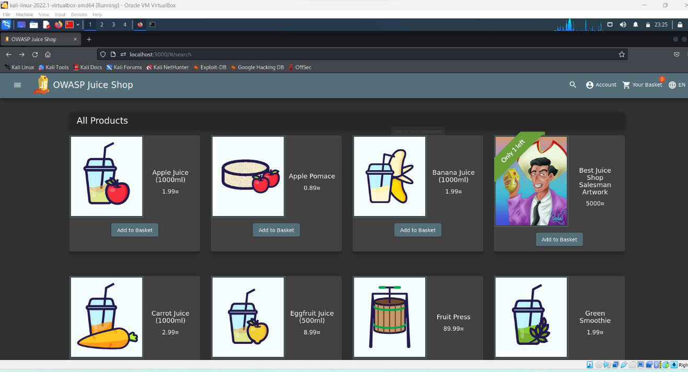
>
> 2. Nested Easter Egg  pesan tersembunyi yang telah disisipkan kedalam
> website Masuk kedalam direktori ftp dengan cara Owasp juiceshop -> Search Github
>
> 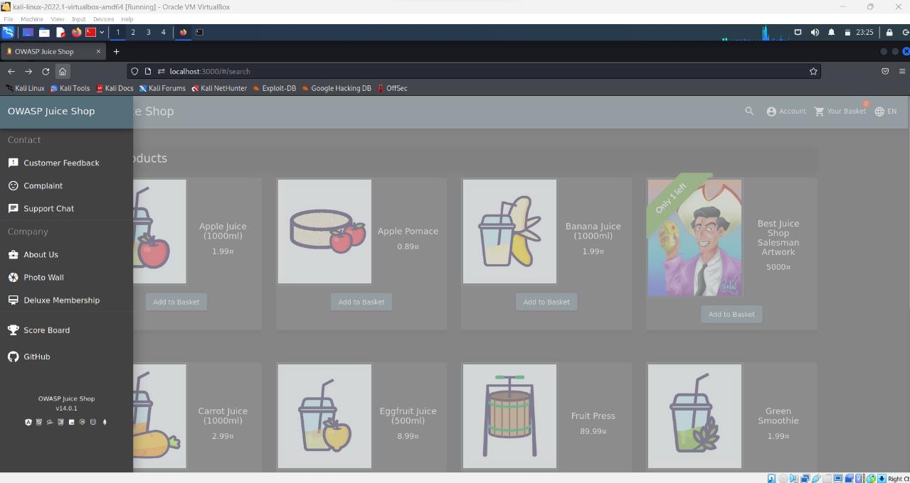
>
> 3. Setelah masuk kedalam folder ftp cari file eastere.gg buka file
> tersebut. Perhatikan pesan pada file.
>
> 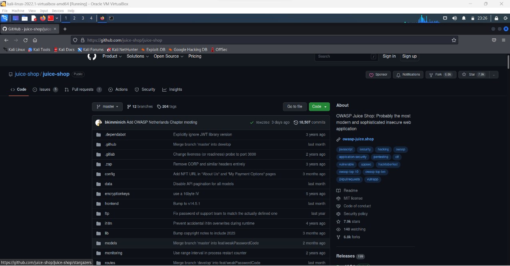
>
> 4. Pada file eastere.gg akan muncul pesan yang berisikan bahwa file
> tersebut bukan eastere.gg yang asli. Baris ke 12 adalah sebuah kode
> yang ditampilkan untuk menemukan easter egg. Untuk pemecahan enkripsi
> kode kita dapat melanjutkan step selanjutnya. Copy terlebih dulu kode
> baris ke 12
>
> 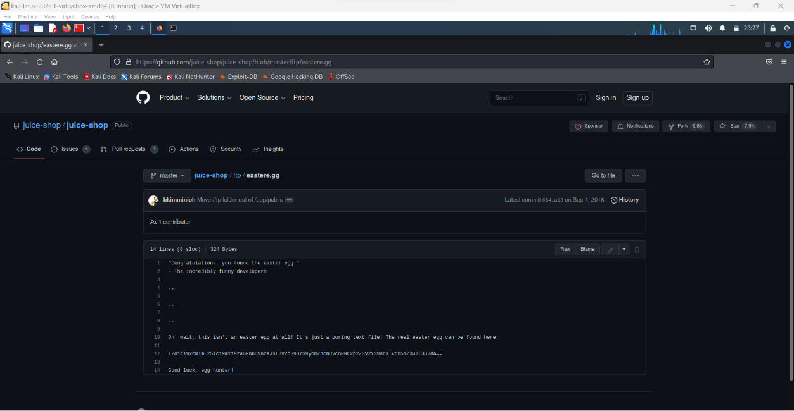
>
> **Cyber Chef**
>
> Cyber Chef adalah sebuah alat pemrosesan data yang dapat digunakan
> untuk melakukan transformasi, konversi, dan analisis data secara
> massal. Alat ini dapat digunakan untuk membantu dalam pemrosesan data
> forensik, pengecekan integritas data, analisis log, atau untuk
> keperluan pemrosesan data lainnya.
>
> 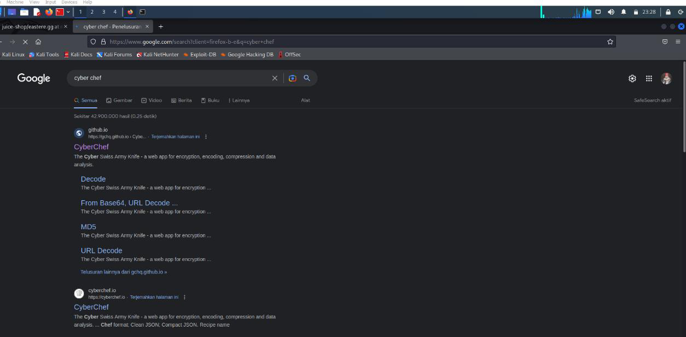
>
> Cyber Chef memiliki antarmuka pengguna yang sederhana dan intuitif,
> yang memungkinkan pengguna untuk memasukkan data dalam berbagai format
> dan melakukan operasi pemrosesan data secara massal dengan mudah. Alat
> ini mendukung banyak fitur, seperti enkripsi dan dekripsi data,
> konversi format data, penguraian dan analisis string, dan banyak lagi.
>
> 5. Penambahan Base 64 dan Rot 13 Setelah menambahkan base 64 dan ROT 13
> kedalam recipe maka output link menuju file tersembunyi sudah bisa
> digunakan, Copy Kode tersebut.
>
> 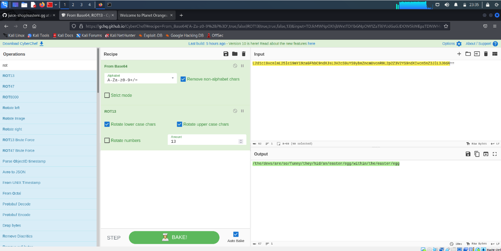
>
> **Base64** adalah teknik pengkodean, yang mengubah data biner, seperti
> gambar dan video, menjadi format ASCII (skema pengkodean untuk
> merepresentasikan data teks dalam system komputer.). Karena data biner
> terdiri dari string 0 dan 1, pengkodean Base64 bekerja dengan mengubah
> karakter ini menjadi himpunan ASCII yang pasti. Hasilnya dapat dengan
> mudah diterjemahkan dengan memetakan karakter ASCII ke dalam nilai
> biner.
>
> Di bawah ini Anda dapat menemukan daftar karakter ASCII standar yang
> digunakan dalam pengkodean Base64.
>
> \- Karakter angka: 0-9.
>
> \- Karakter alfabet huruf besar: AZ.
>
> \- Karakter alfabet huruf kecil: az.
>
> **ROT 13(Rotation 13)**
>
> Salah satu contoh dari "substitution cipher" adalah Rot13. Metode
> rot13 merupakan metode enkripsi yang mengubah suatu huruf menjadi
> huruf yang letaknya 13 posisi dari huruf semula. Misalnya 'A' akan
> berubah menjadi 'N' , 'B' berubah menjadi 'O', dst
>
> 6. Hasil setelah kode dipecahkan oleh cyber chef muncul teks link
> tambahkan link setelah port 3000 atau
>
> 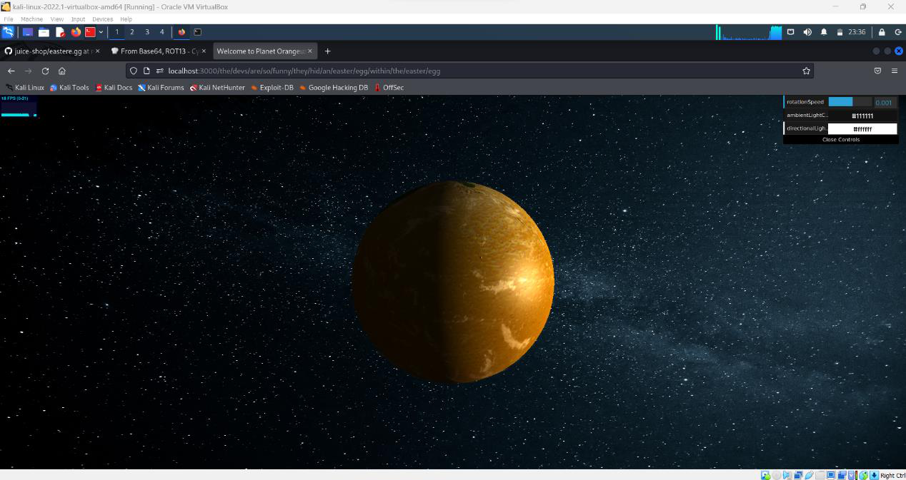
>
> ## Percobaan 2 - Weird Crypto (Cryptographic Issues)
> 
> 1. Buka Menu Juiceshop -> Customer Feedback
>
> 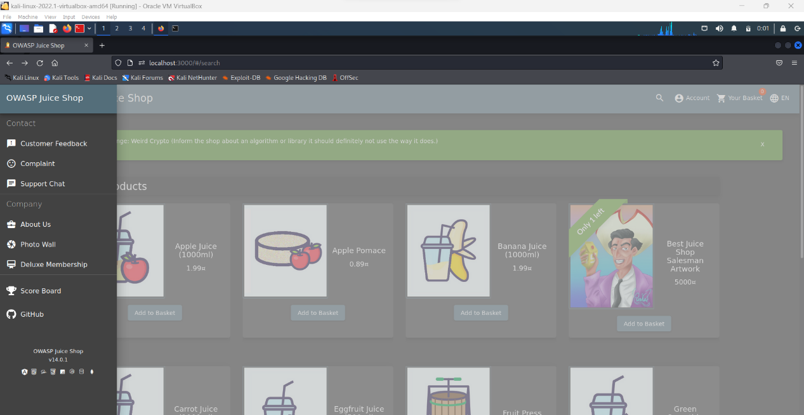
>
> 2. Selanjutnya pada menu Customer Feedback masukan kata MD5 pada comment,
> masukan rating , chaptcha, dan submit.
>
> 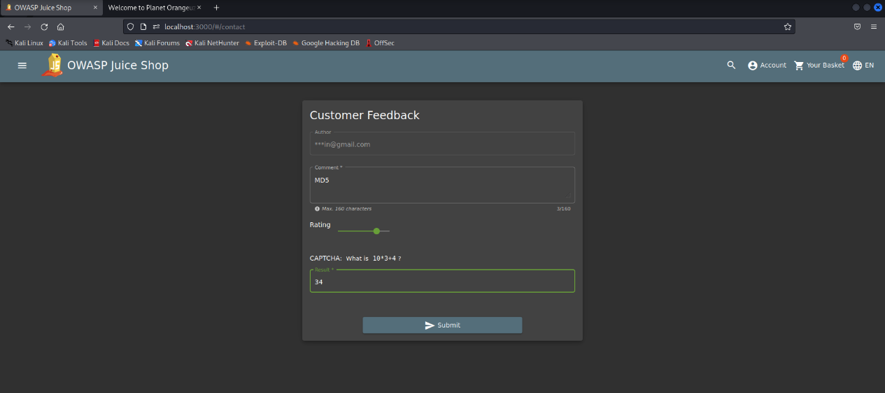
>
> 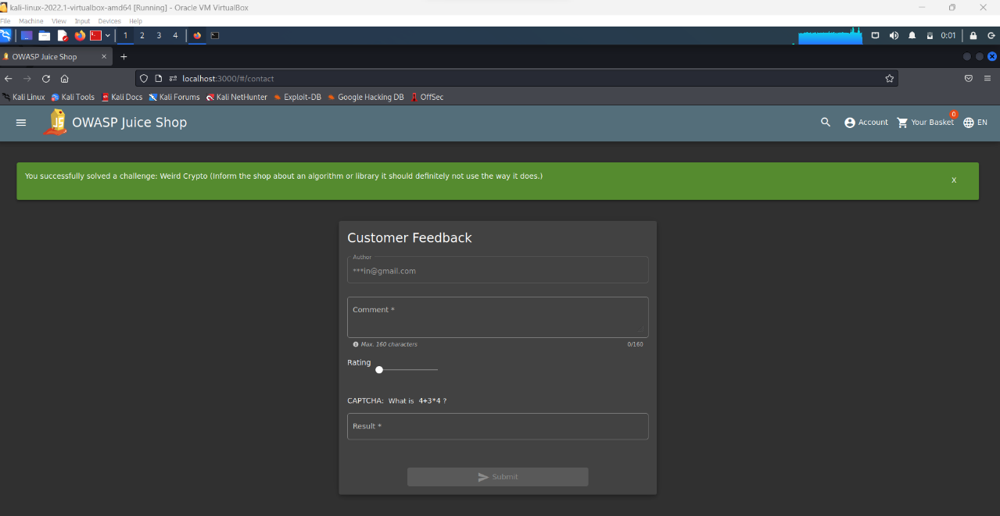
>
> Pada tantangan kali ini, kita ditantang untuk menemukan beberapa weak
> cryptographic algorithm atau algoritma yang lemah namun sering digunakan untuk
> melakukan kriptografi atau melakukan enkripsi pada data-data krusial,
> yang seharusnya memiliki privasi dan keamanan lebih. Mengacu pada
> website https://pwning.owasp juice.shop/part2/cryptographicissues.html
> disini kita harus menemukan 5 weak cryptograpic algorithm yang sering
> digunakan
>
> 1.**MD4 / MD5** sangat umum digunakan, terutama dalam mengenkripsi
> password yang akan disimpan dalam database. Salah satu kelemahan dari
> MD4 / MD5 ini merupakan Collision Vulnerability, dikarenakan berapapun
> panjang dari sebuah text, maka tetap akan dirubah menjadi 128 bit
> saja. yang mana dalam skala penyimpanan data yang sangat besar akan
> ada kemungkinan 2 file yang berbeda akan memiliki nilai hash yang
> sama, seperti contoh berikut :
>
> 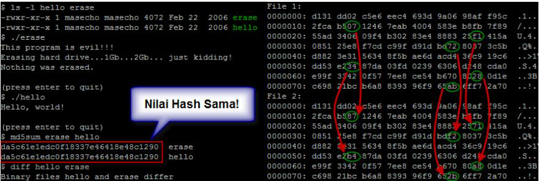
>
> **2.RC4 / RC2**\
> **Melakukan percobaan dengan RC4**
>
> 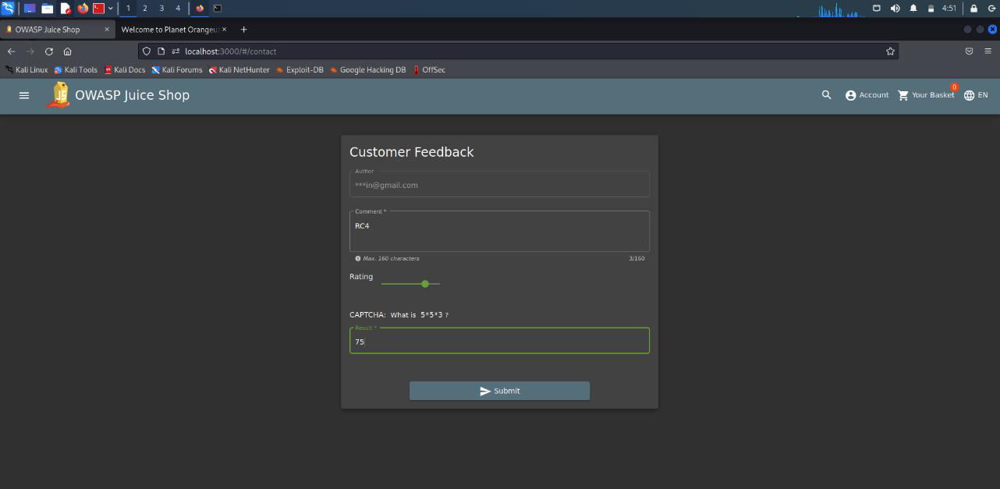
> Selain menggunakan MD4/MD5 disini kami juga melakukan percobaan cryptographic failure dengan menggunakan kode RC4 / 
> RC2
>
> 3\. DES / 3DES,
>
> 4\. Blowfish,
>
> 5\. SHA-1
> 
> ## Kesimpulan
> Disini kami berhasil membuktikan bahwa website owasp juice shop ini masih memiliki kerentanan yang mana disebutkan 
> dalam owasp 10 yakni cryptographic failures dimana saya dapat melihat adanya kode yang disembunyikan dan dapat 
> dilacak serta dilihat dengan menggunakan beberapa tools yang ada.
>

