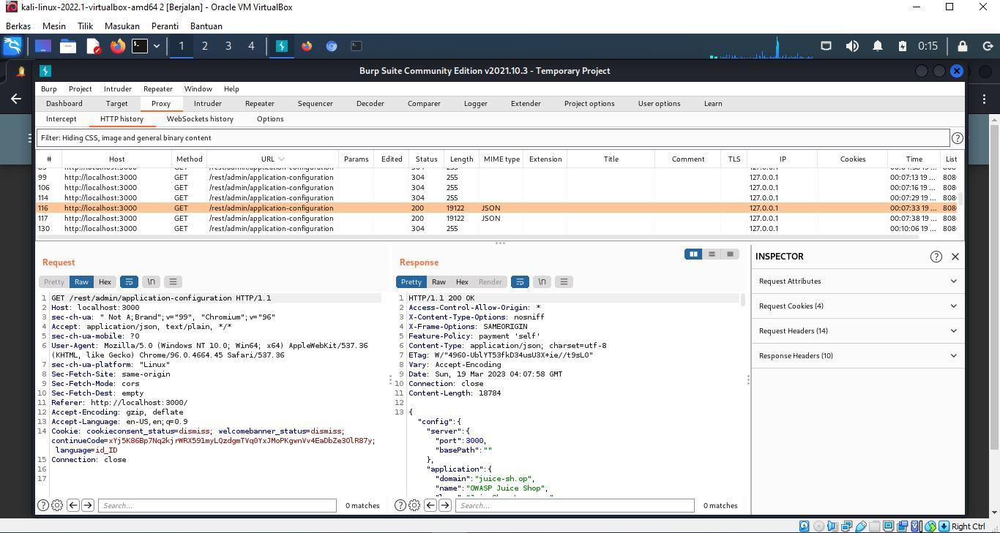

## Cover

<h3 align="center">
    <b>Praktikum Kemanan Jaringan</b> 
    A3 - Injection (OWASP 10 Juice Shop)
</h3>
 

  

 

    Dosen Pembimbing: 
    Ferry Astika Saputra, S.T., M.Sc.

 

    Disusun Oleh: 
    Lula Rania Salsabilla (3122640045)

 

    <b>
        KELAS D4 LJ IT B  
        JURUSAN D4 LJ TEKNIK INFORMATIKA  
        DEPARTEMEN TEKNIK INFORMATIKA DAN KOMPUTER   
        POLITEKNIK ELEKTRONIKA NEGERI SURABAYA  
        2023
    </b>

 

> ## Injection
>
> ●**Informasi Dasar**\
> OWASP Top Ten adalah daftar risiko keamanan aplikasi web paling kritis
> yang diidentifikasi oleh Open Web Application Security Project
> (OWASP). Kerentanan injeksi terdaftar sebagai salah satu dari 10
> risiko keamanan teratas dalam aplikasi web.
>
> Serangan injeksi terjadi ketika input pengguna yang tidak dipercaya
> tidak divalidasi atau dibersihkan dengan benar, memungkinkan kode
> berbahaya disuntikkan ke dalam database aplikasi atau lingkungan
> eksekusi. Hal ini dapat menyebabkan berbagai pelanggaran keamanan yang
> serius, seperti akses tidak sah ke data sensitif, manipulasi data, dan
> eksekusi kode berbahaya.
>
> Kategori OWASP Top 10 Injection mencakup berbagai jenis serangan
> injeksi, seperti injeksi SQL, injeksi LDAP, dan injeksi XML. Injeksi
> SQL adalah jenis serangan injeksi yang paling umum dan terkenal, di
> mana penyerang menyuntikkan pernyataan SQL berbahaya ke bidang masukan
> pengguna, mengeksploitasi kerentanan untuk mengambil, memodifikasi,
> atau menghapus data sensitif.
>
> 
>
> **Skenario 1**\
> **String query = \"SELECT \\\* FROM accounts WHERE custID=\'\" +
> request.getParameter(\"id\") + \" \' \";**\
> Serangan injection yang mungkin terjadi pada kode ini adalah SQL
> Injection. Pada serangan ini, attacker dapat memanipulasi input
> parameter \"id\" untuk menyuntikkan kode SQL yang tidak sah ke dalam
> string query, seperti mengganti nilai \"id\" dengan \"1\' OR 1=1 \--\"
> yang akan mengubah string query menjadi \"SELECT \* FROM accounts WHERE custID=\'1\' OR 1=1 \--\'\", dan ini akan 
> mengeksekusi perintah SQL yang tidak diinginkan.
>
> **Skenario 2**\
> **Query HQLQuery = session.createQuery(\"FROM accounts WHERE
> custID=\'\" + request.getParameter(\"id\") + \" \' \");**\
> Serangan injection yang mungkin terjadi pada kode ini adalah HQL
> Injection. Pada serangan ini, attacker dapat memanipulasi input
> parameter \"id\" untuk menyuntikkan kode HQL yang tidak sah ke dalam
> query, seperti mengganti nilai \"id\" dengan \"1\' OR 1=1 \--\" yang
> akan mengubah query menjadi \"FROM accounts WHERE custID=\'1\' OR 1=1
> \--\'\", dan ini akan mengeksekusi query HQL yang tidak diinginkan.
>
> Dalam kedua skenario , penyerang mengubah nilai parameter \'id\' di
> browser mereka untuk mengirim: **\'UNION SLEEP(10);\--**\
> **http://example.com/app/accountView?id=\' UNION SELECT
> SLEEP(10);\--** attacker mencoba melakukan serangan SQL Injection
> dengan memasukkan payload \' UNION SELECT SLEEP(10);\-- ke dalam
> parameter \"id\". Payload ini akan menggabungkan query asli dengan
> query yang ditambahkan oleh attacker, yaitu SELECT SLEEP(10), yang
> akan menunda eksekusi query sebelumnya selama 10 detik. Tanda \"\--\"
> digunakan untuk mengakhiri query asli dan mengabaikan karakter lain
> yang mungkin ada pada query.
>
> Ini mengubah arti dari kedua Query untuk mengembalikan semua rekaman
> dari tabel akun. Serangan yang lebih berbahaya dapat mengubah atau
> menghapus data atau bahkan menjalankan prosedur tersimpan.
>
> Untuk mencegah serangan injeksi, pengembang harus menerapkan praktik
> pengkodean yang aman dan menggunakan kueri berparameter atau
> pernyataan yang disiapkan untuk memvalidasi dan membersihkan input
> pengguna. Selain itu, validasi masukan dan penyandian keluaran harus
> dilakukan untuk memastikan bahwa masukan pengguna diformat dan
> ditampilkan dengan benar untuk mencegah serangan skrip lintas situs
> (XSS). Juga disarankan untuk menggunakan alat seperti firewall
> aplikasi web (WAF) dan pemindai kerentanan untuk mengidentifikasi dan
> mengurangi potensi kerentanan injeksi.
>
> ## Percobaan : Login Admin
>
> 1. Masukkan email dan password secara dummy di login admin
>
> 
>
> **Analisis**\
> Melakukan Login dengan email Admin dan Password Admin tanpa diikuti
> dengan nama domain email dibelakangnya. Hal ini untuk membuktikan
> apakah kami dapat login dengan email dan password yang benar benar random.
>
> 2. Mengecheck menu proxy http_request
>
> 
>
> **Analisis**\
> Mengecheck HTTP Req didalam menu proxy, dimana kami mencari alamat url
> /rest/user/login untuk melihat request dan response yang diberikan.
> Ternyata kami belum dapat memasuki akun admin. Karena belum terautentikasi data
> email dan passwordnya.
>
> 3. Memindahkan request ke repeater untuk dapat dimodifikasi isi
> requestnya
>
> 
>
> **Analisis**\
> Disini kami mencoba melihat kembali apakah saat dilakukan penyalinan
> request, response diberikan sama sebelum kami modifikasi.
>
> 
>
> **Analisis**\
> Disini kami memodifikasi email dengan injection sesuai dengan arahan
> modul dengan memberikan tanda ' or 1=1\-- untuk dapat melakukan
> generate response yang sesuai dan mendapatkan token authenthication
> serta kode pesan 200 yakni OK. Disini kami melihat pada response bahwa
> kami dapat melakukan injeksi dan berhasil mendapatkan pesan sukses.
>
> 4. Melakukan login user dengan email sesuai dengan modifikasi pada
> repeater
>
> 
>
> 
>
> **Analisis**\
> Setelah memasukkan kode injection yang ada tersebut, kami berhasil
> mengakses halaman dashboard dan masuk sebagai user admin.
>
> ## Percobaan : Login Bender
>
> 1. Menyiapkan burpsuite, terminal, dan browser dari burpsuite untuk mengakses localhost:3000 juice shop
>
> 2. Mengamati http request dari burpsuite, dan melihat hasil request
> dan respond /rest/admin/application-configuration.
>
> 
>
> **Analisis**\
> Response menyatakan informasi terkait website aplikasi juiceshop,
> informasi yang penting disini adalah informasi nama domain, untuk
> dapat melihat domain email dari akun akun yang ada di dalam OWASP
> Juice Shop.
>
> 3. Setelah itu, login menggunakan email nama bender diikuti dengan
> domain dan password random.
>
> 
>
> **Analisis**\
> Sesudah mengetahui nama domain, disini kami mencoba memasukkan email
> user "bender" dengan diikuti domain yang telah ditemukan yakni
> "@juice-sh.op" dan kemudian kami memasukkan password random yakni "test" di dalam form
> input password. Tentunya ketika kami klik button login, credential
> user salah dan tidak bisa login ke akun bender.
>
> 4. Melihat http_request mengenai percobaan login yang gagal atau
> invalid
>
> 
>
> **Analisis**\
> Disini kami mengamati http_request dengan url "/rest/user/login'
> dimana terdapat request dan response diatas yang mana terdapat pesan error yang menjelaskan alasan 
> mengapa request gagal, yaitu pesan informasi mengenai \"Invalid email or password\".
>
> 5. Menyimpan baris data request ke file txt
>
> 
>
> **Analisis**\
> Disini kami menyalin data request raw menuju ke login.txt, kemudian
> menambahkan tanda "\*" di bagian email bender seperti dibawah ini.
>
> 
>
> 6. Menggunakan Sql Map
>
> 
>
> **Analisis**\
> Disini kami menggunakan tools berupa SQLMap yang merupakan tool atau program komputer yang dapat
> digunakan untuk melakukan penetrasi testing pada aplikasi web yang
> rentan terhadap serangan SQL injection. SQLMap dapat melakukan ekstraksi
> informasi sensitif seperti username, password, dan data penting
> lainnya yang tersimpan dalam database dengan melakukan injeksi SQL
> pada aplikasi yang rentan.
>
> sqlmap -r login.txt, opsi -r digunakan untuk menunjukkan
> bahwa SQLMap akan melakukan serangan terhadap satu atau beberapa
> permintaan HTTP yang telah direkam dalam file login.txt. File
> login.txt pada perintah ini berisi log atau catatan permintaan HTTP
> yang merekam tindakan login pada sebuah website. 
>
> SQLMap akan mencoba mengeksploitasi celah keamanan pada permintaan HTTP tersebut dengan
> menggunakan teknik-teknik injeksi SQL dan mencoba mendapatkan akses ke
> dalam database yang digunakan oleh website tersebut.
>
> Dengan menggunakan perintah -r pada SQLMap, pengguna dapat dengan mudah
> mengeksploitasi celah keamanan pada aplikasi web yang rentan terhadap
> SQL injection dengan menggunakan permintaan HTTP yang telah direkam
> sebelumnya.
>
> 
>
> 
>
> **Analisis**\
> Dengan perintah diatas, sistem akan mengignore atau tidak membaca kode
> 401 yang mana merupakan kode unathorized sehingga ketika kami check ke
> halaman localhost 3000. Terlihat bahwa terdapat notifikasi bahwa kita
> berhasil login dengan menggunakan akun bender.
>
> 
>
> 7. Memodifikasi Email dengan Menambahkan Character
>
> 
>
> **Analisis**\
> Disini kami melakukan penambahan karakter setelah email bender
> dituliskan yakni karakter '\-- yang merubah response menjadi memiliki
> pesan 200 atau OK kemudian ketika kami coba menggunakan email tersebut
> dan password random kami diawal kami berhasil masuk ke halaman
> dashboard dan login sebagai akun bender.
>
> 8. Memodifikasi Password Akun
>
> 
>
> **Analisis**\
> Kemudian kami mencoba untuk mengubah password menjadi password lainnya
> yang sama randomnya, dan memproses kode tersebut di repeater burpsuit.
> Yang mana tetap memiliki pesan 200 OK dan bisa mengakses halaman
> dashboard dan login sebagai bender seperti screenshoot dibawah ini :
>
> 
>
> ## Percobaan : Login Jim
>
> 1. Mengiputkan email jim dengan pasword bebas
>
> 
> 2. Berhasil login ke dalam OWASP Juice Shop
>
> 
>
> 3\. Login menggunakan email jim
>
> 
>
> ## Kesimpulan
>
> Disini kami berhasil membuktikan bahwa website owasp juice shop ini
> masih memiliki kerentanan yang mana disebutkan dalam owasp 10 yakni
> injection dimana kami dapat login dengan akun lainnya dengan
> menambahkan karakter pada email dan menggunakan password yang random.
> Dan dapat menggunakan sqlmap untuk melakukan injection terhadap
> website owasp juiceshop.
