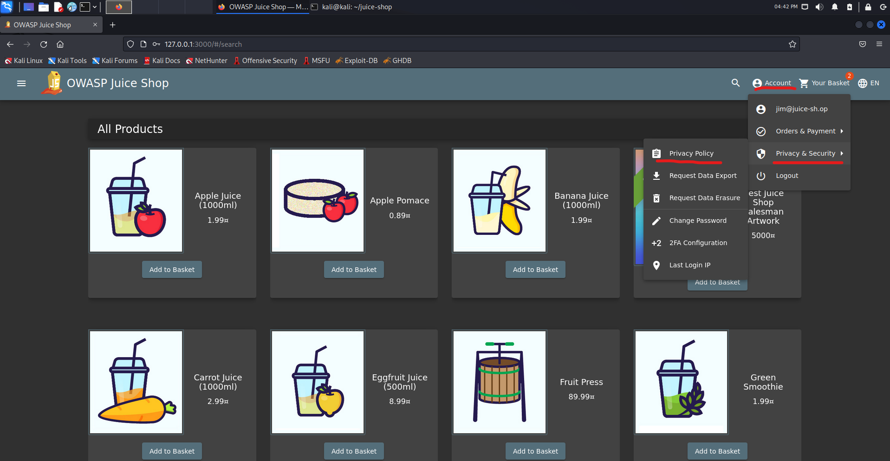
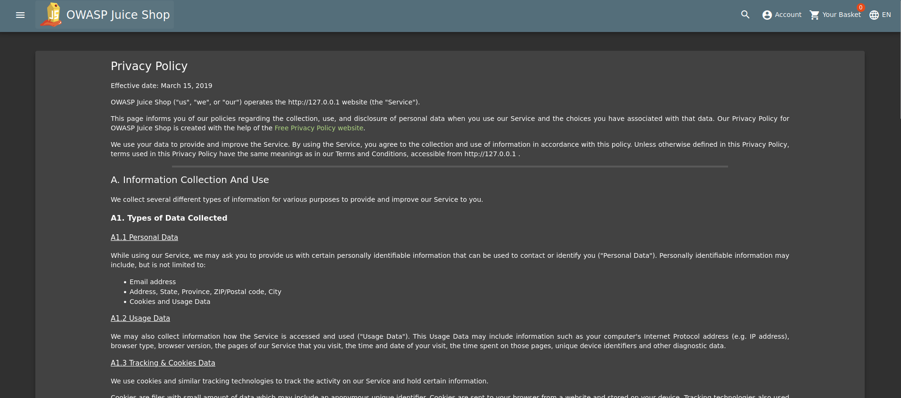
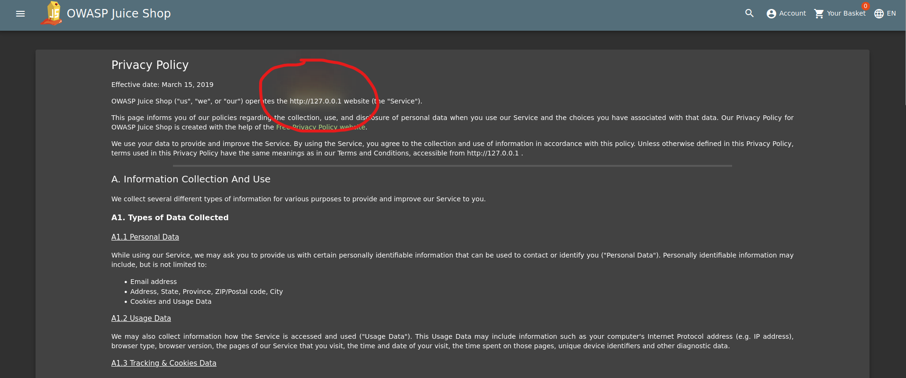
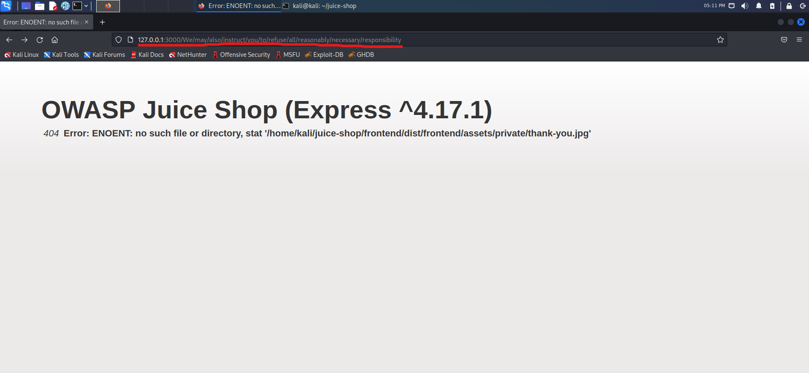

## Cover

<h3 align="center">
    <b>Praktikum Kemanan Jaringan</b> 
    A4 Insecure Design (OWASP 10 Juice Shop)
</h3>
 

  

 

    Dosen Pembimbing: 
    Ferry Astika Saputra, S.T., M.Sc.

 

    Disusun Oleh: 
    Lula Rania Salsabilla (3122640045)
    Fifin Nur Rahmawati (3122640040)

 

    <b>
        KELAS D4 LJ IT B  
        JURUSAN D4 LJ TEKNIK INFORMATIKA  
        DEPARTEMEN TEKNIK INFORMATIKA DAN KOMPUTER   
        POLITEKNIK ELEKTRONIKA NEGERI SURABAYA  
        2023
    </b>

 

## Laporan

Insecure Design adalah sebuah representasi kategori yang luas dari banyak kelemahan yang berbeda, yang diekspresikan sebagai "desain kontrol yang tidak ada atau kurang efisien." Desain yang tidak aman adalah sebuah representasi kategori yang luas dari banyak kelemahan yang berbeda, yang diekspresikan sebagai "desain kontrol yang tidak ada atau kurang efisien." Desain tidak aman bukan sumber dari semua kategori risiko Top 10 yang lain. Ada perbedaan antara desain tidak aman dan implementasi tidak aman. Kami membedakan antara cacat desain dan kerusakan implementasi karena suatu alasan, mereka memiliki root cause dan remediasi yang berbeda. Sebuah desain aman masih bisa memiliki kerusakan implementasi yang mengarah ke kerentanan yang dapat dieksploitasi. Suatu desain tidak aman tidak dapat diperbaiki oleh sebuah implementasi yang sempurna karena menurut definisi, kendali keamanan yang diperlukan tidak pernah dibuat untuk bertahan terhadap serangan tertentu. Satu dari faktor yang berkontribusi terhadap desain tidak aman adalah ketiadaan pembuatan profil risiko bisnis yang inheren dalam perangkat lunak atau sistem yang sedang dikembangkan, maka menjadi kegagagalan untuk menentukan desain keamanan level apa yang diperlukan. [[1](https://owasp.org/Top10/id/A04_2021-Insecure_Design/)].

### A. Privacy Policy Inspection

Pada kesempatan kali ini kami akan mencoba untuk melakukan inspeksi pada halaman privacy policy untuk mendapatkan informasi penting dari web OWASP Juice Shop ini.

1. Masuk kehalaman privacy policy dengan melakukan klik account pada bagian navbar lalu klik privacy & security dan selanjutnya kita klik privacy policy.

    

2. Kemudian akan muncul dan terdapat halaman privacy policy seperti gambar di bawah ini.

    

3. Pada halaman yang tertampil ketika kita melakukan hover pada bagian alamat domain, terdapat tanda warna kuning dan merah seperti pada gambar ini.

    

4. Tidak hanya itu, terdapat kalimat kalimat lainnya yang ketika dihover muncul warna serperti itu, berikut ini adalah list kalimat yang memiliki permasalahan serupa :

    - http://127.0.0.1
    - we may also
    - instruct you
    - to refuse all
    - reasonably necessary
    - responsibility

4. Kemudian gabungkan semua kalimat tersebut menjadi sebuah enpoint url yang mana nantinya akan menjadi link berikut http://127.0.0.1:3000/We/may/also/instruct/you/to/refuse/all/reasonably/necessary/responsibility dan akan muncul halaman website seperti gambar berikut

    

    Analisis
    Dari halaman pada gambar diatas, kami dapat melihat informasi penting seperti framework yang digunakan beserta dengan versi nya, kemudian kita juga dapat melihat directory structure nya juga. Oleh karena itu percobaan ini termasuk Insecure Design karena melanggar "CWE-209 Generation of Error Message Containing Sensitive Information". Dimana informasi yang sensitif dan penting akan tertampil dan dilihat user padahal informasi tersebut harus disimpan dengan aman dan secure.