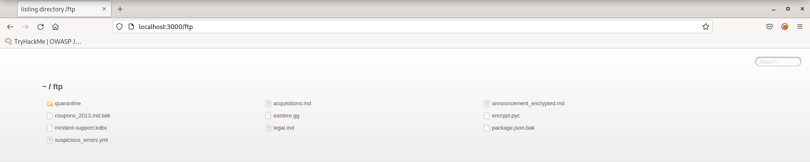
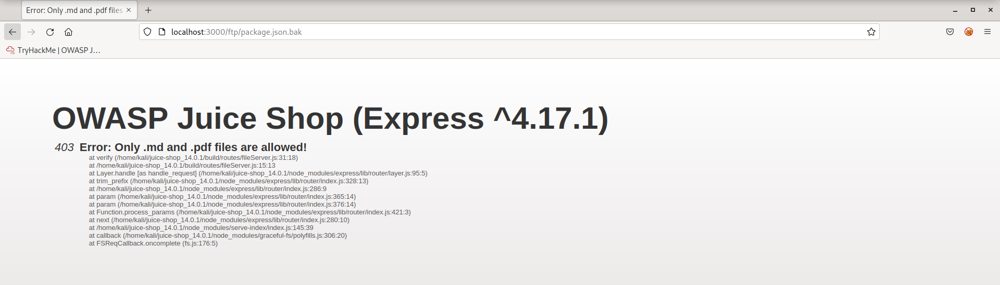
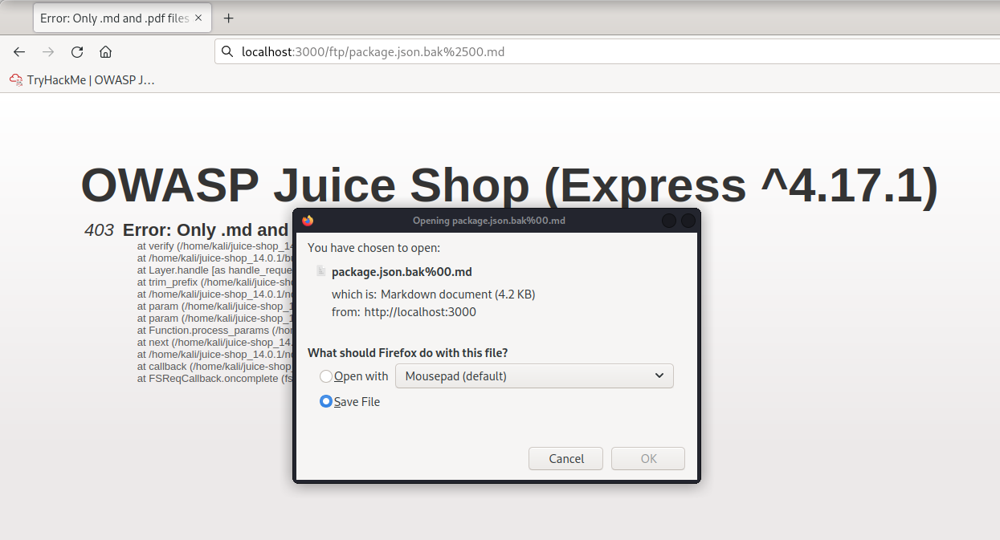
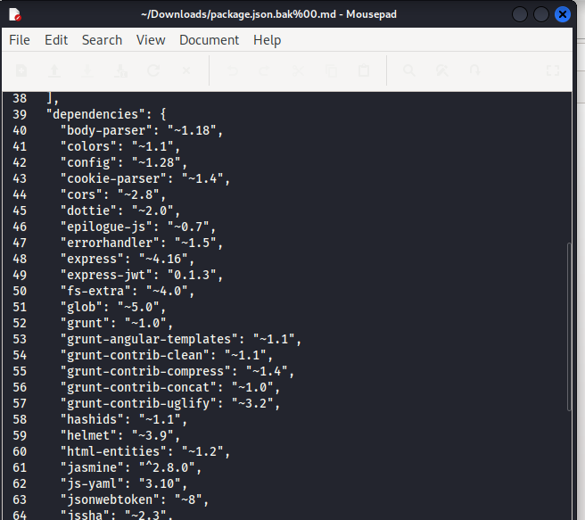
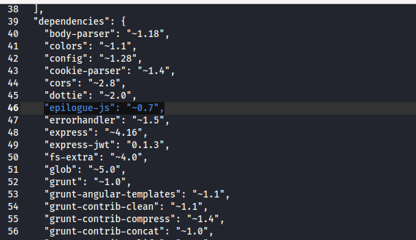
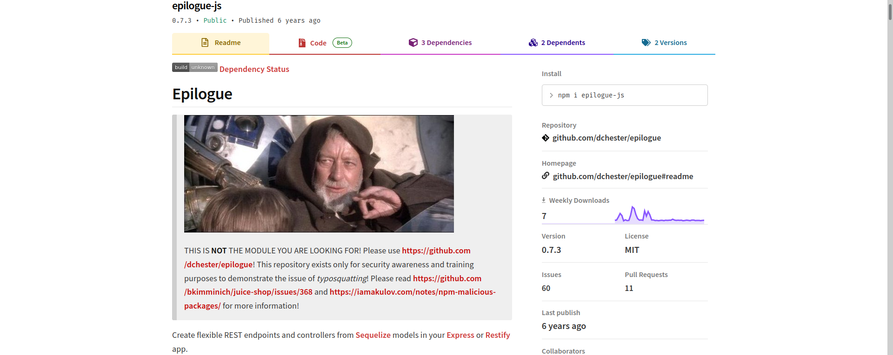
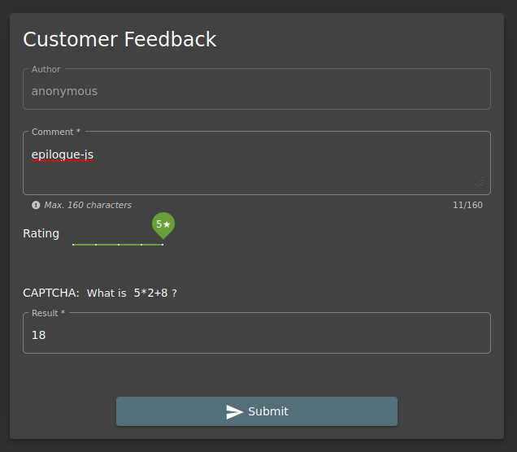
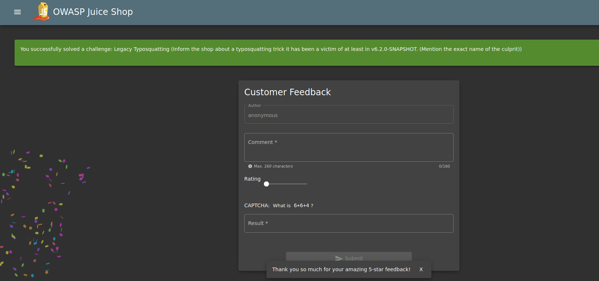

## Cover

<h3 align="center">
    <b>Praktikum Kemanan Jaringan</b> 
    A6 Vulnerable Component (OWASP 10 Juice Shop)
</h3>
 

  

 

    Dosen Pembimbing: 
    Ferry Astika Saputra, S.T., M.Sc.

 

    Disusun Oleh: 
    Lula Rania Salsabilla (3122640045)
    Fifin Nur Rahmawati (3122640040)

 

    <b>
        KELAS D4 LJ IT B  
        JURUSAN D4 LJ TEKNIK INFORMATIKA  
        DEPARTEMEN TEKNIK INFORMATIKA DAN KOMPUTER   
        POLITEKNIK ELEKTRONIKA NEGERI SURABAYA  
        2023
    </b>

 

<h3 align="center"> A06 VULNERABLE COMPONENT </h3>  

A06 Vulnerable Component adalah salah satu dari 10 kategori utama kerentanan dalam aplikasi web yang diidentifikasi oleh Open Web Application Security Project (OWASP) Top 10. Kerentanan ini terkait dengan adanya komponen atau perangkat lunak yang rentan atau memiliki celah keamanan yang dapat dieksploitasi oleh penyerang.

Sumber kerentanan komponen rentan dapat bervariasi, tetapi beberapa sumber umum meliputi:

1. Ketika menggunakan versi perangkat lunak yang sudah tidak didukung atau tidak diperbarui, ada kemungkinan bahwa celah keamanan yang diketahui telah diperbaiki di versi yang lebih baru masih ada dalam versi lama. Penyerang dapat memanfaatkan celah ini untuk melakukan serangan.

2. Penggunaan komponen pihak ketiga dalam pengembangan aplikasi dapat menjadi sumber kerentanan. Jika komponen tersebut memiliki kerentanan keamanan, maka aplikasi yang mengandalkan komponen tersebut juga akan rentan.

3. Mendapatkan komponen dari sumber yang tidak terpercaya atau tidak resmi dapat meningkatkan risiko kerentanan. Komponen yang disusupi atau dimodifikasi dengan kode berbahaya dapat menyebabkan celah keamanan di dalam aplikasi.

4. Jika komponen tidak diperbarui secara teratur atau tidak mendapatkan pemeliharaan yang memadai, maka kerentanan baru yang ditemukan tidak akan diperbaiki. Hal ini meningkatkan risiko serangan terhadap komponen tersebut.

Berikut adalah serangan vulnerable component yang dilakukan dengan Legacy Typosquatting:

1. Menambahkan /ftp pada path url aplikasi juice shop. Setelah ditambahkan /ftp maka akan terlihat beberapa file dan folder sesuai screenshoot.
   

2. Buka file package.json.bak
   

3. Tambahkan %2500.md pada path url aplikasi juice shop dan download file
   

4. Buka file yang telah di-download, kemudian lihat pada bagian dependencies
   
   Terdapat dependency yang mencurigakan  
   

5. Cek dependency
   

6. Masukkan nama dependency yang mencurigakan tersebut ke dalam halaman feedback
   

7. Challenge berhasil dilakukan
   

