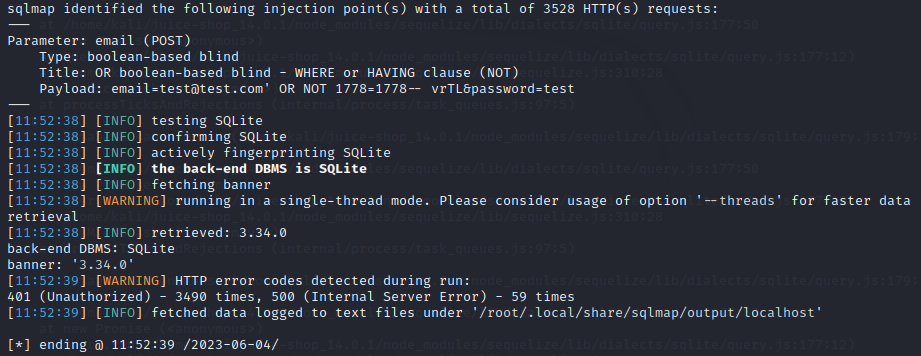

## Cover

<h3 align="center">
    <b>Praktikum Kemanan Jaringan</b> 
    A5 Security Misconfiguration (OWASP 10 Juice Shop)
</h3>
 

  

 

    Dosen Pembimbing: 
    Ferry Astika Saputra, S.T., M.Sc.

 

    Disusun Oleh: 
    Lula Rania Salsabilla (3122640045)
    Fifin Nur Rahmawati (3122640040)

 

    <b>
        KELAS D4 LJ IT B  
        JURUSAN D4 LJ TEKNIK INFORMATIKA  
        DEPARTEMEN TEKNIK INFORMATIKA DAN KOMPUTER   
        POLITEKNIK ELEKTRONIKA NEGERI SURABAYA  
        2023
    </b>

 

# Laporan

A07 - Identification and Authentication Failures adalah salah satu kategori kerentanan keamanan yang mengacu pada kegagalan atau kelemahan dalam proses identifikasi dan otentikasi pengguna atau entitas dalam suatu sistem atau aplikasi. Kelemahan dalam identifikasi dan otentikasi dapat mengakibatkan akses tidak sah, pelanggaran data, atau insiden keamanan lainnya. 

Berikut contoh terkait A07 - Identification and Authentication Failures:

1. Penggunaan kata sandi yang lemah atau kredensial yang mudah ditebak (seperti "password" atau "123456") dapat memudahkan penyerang untuk mendapatkan akses tidak sah ke akun pengguna.

2. Kurangnya Autentikasi Dua Faktor (2FA), tidak menerapkan 2FA membuat akun pengguna lebih rentan terhadap akses tidak sah.

3. Kebijakan kata sandi yang lemah, seperti tidak menerapkan persyaratan kompleksitas kata sandi atau mengizinkan pengguna untuk menggunakan kata sandi lama, dapat meningkatkan risiko kerentanan terkait kata sandi.

4. Serangan Credential Stuffing dan Brute-Force. Penyerang dapat memanfaatkan mekanisme otentikasi yang lemah dengan mencoba masuk dengan berbagai kombinasi nama pengguna dan kata sandi dalam serangan brute-force atau credential stuffing. 

Untuk mengatasi kegagalan identifikasi dan otentikasi, penting untuk mengikuti praktik terbaik untuk autentikasi pengguna yang aman, termasuk menerapkan kebijakan kata sandi yang kuat, mengaktifkan autentikasi dua faktor, menggunakan protokol yang aman, secara berkala memperbarui dan memperbaiki sistem, serta memantau aktivitas mencurigakan. Penilaian keamanan secara teratur dan pengujian penetrasi dapat membantu mengidentifikasi dan mitigasi kerentanan tersebut.  

Berikut adalah kerentanan yang ditemukan pada OWASP Juice Shop  
**A. Percobaan 1**  
Percobaan ini bertujuan untuk mereset password dari akun OWASP Bjoern via Forgot Password.  

1. Mencari akun user Bjoem pada review salah satu produk Juice Shop  
   
   Copy alamat email Bjoern

2. Pindah ke halaman login lalu klik Forgot Your Password  
   

3. Paste email, kemudian jawab pertanyaan apa nama hewan favorit  
   

4. Buka browser, cari keyword "Bjoern's Favorite Pet"  
   

5. Buka kembali halamanan Forgot Your Password, masukkan nama hewan favorite, dan ketikkan password baru, contohnya: Admin123  
   

6. Challenge berhasil diselesaikan 
   

7. Login berhasil dilakukan 
   
   

**B. Percobaan 2**  
Percobaan ini bertujuan untuk mencoba login menggunakan kredensial user dari administrator tanpa mengubah password saat ini atau menerapkan SQL Injection.

1. Ketikkan perintah sqlmap berikut :  
   sqlmap -u "http://localhost:3000/rest/user/login" --data="email=test@test.com&password=test" --level=5 --risk=3 --banner --ignore-code=401 --dbms='sqlite' --technique=B  
      
   Hasil dari perintah di atas adalah Error 401 yang mana request yang dikirim ke website tidak bisa diautentikasi

2. Mencoba kembali perintah yang sama. Namun email diubah menjadi admin@juice-sh.op dan password tetap test  
   
   Hasilnya, tetap terdapat Error 401 yanng berarti email dan password masih belum benar.

3. Mencoba kembali dengan email admin@juice-sh.op dan password admin123 berdasarkan ketentuan ketika membuat password.  
   

4. Challenge berhasil diselesaikan  
   