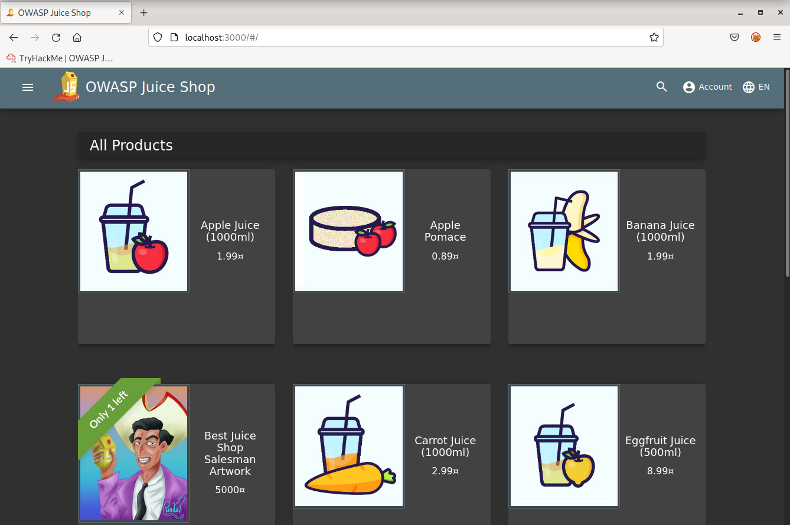
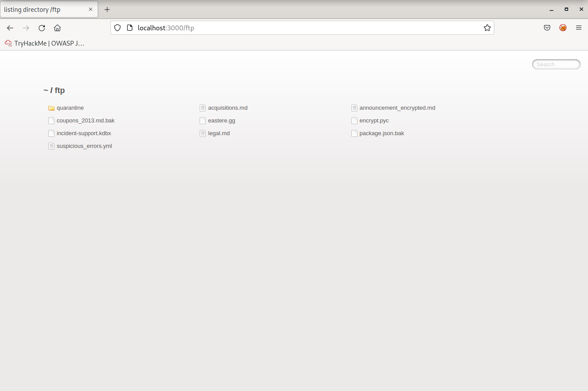
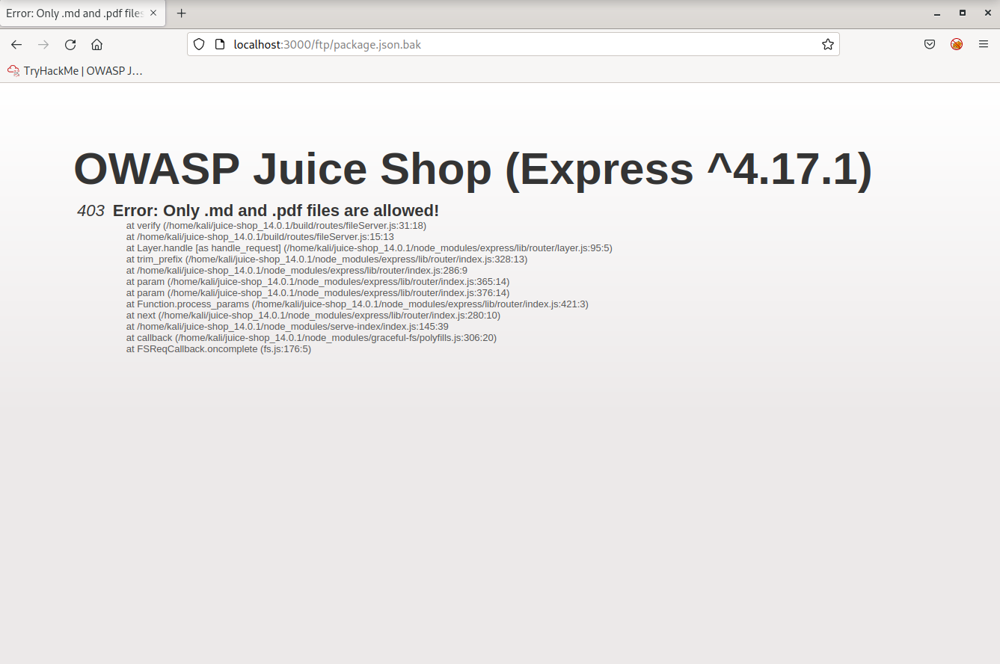
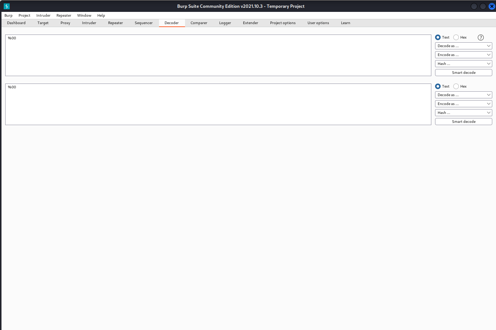
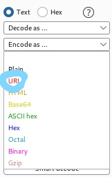
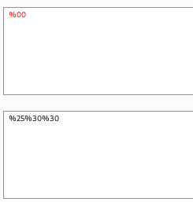
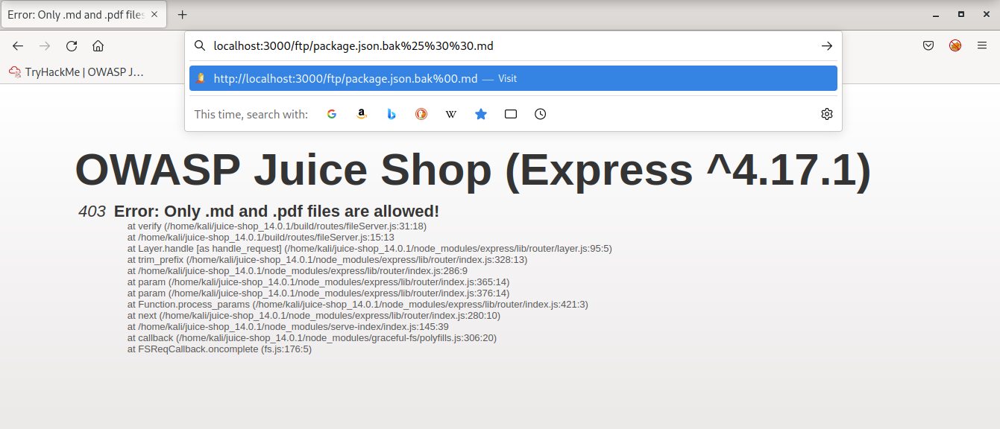
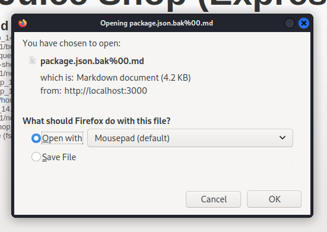
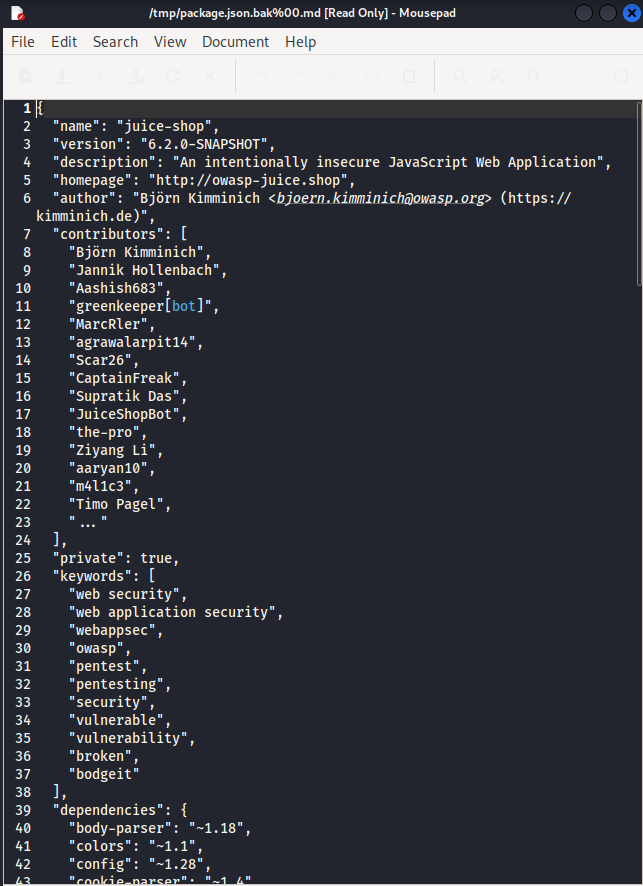

## Cover

<h3 align="center">
    <b>Praktikum Kemanan Jaringan</b> 
    A8 - Software And Data Integrity Failures (OWASP 10 Juice Shop)
</h3>
 

  

 

    Dosen Pembimbing: 
    Ferry Astika Saputra, S.T., M.Sc.

 

    Disusun Oleh: 
    Lula Rania Salsabilla (3122640045)
    Fifin Nur Rahmawati (3122640040)

 

    <b>
        KELAS D4 LJ IT B  
        JURUSAN D4 LJ TEKNIK INFORMATIKA  
        DEPARTEMEN TEKNIK INFORMATIKA DAN KOMPUTER   
        POLITEKNIK ELEKTRONIKA NEGERI SURABAYA  
        2023
    </b>

 

# Laporan

A8 - Software and Data Integrity Failures adalah salah satu kategori kerentanan keamanan yang terkait dengan kegagalan atau kelemahan dalam menjaga integritas perangkat lunak dan data yang digunakan dalam suatu sistem atau aplikasi. Kerentanan ini dapat mengakibatkan manipulasi data, perubahan tidak sah, atau kerusakan pada perangkat lunak atau data yang dapat mempengaruhi kehandalan, keandalan, dan kebenaran sistem. 

1. Kerentanan ini terjadi ketika penyerang berhasil memodifikasi atau memanipulasi data yang ada dalam sistem dengan cara yang tidak sah. Hal ini dapat mengakibatkan kerusakan atau penyimpangan data yang dapat mempengaruhi integritas sistem.

2. Ketika perangkat lunak atau sistem melakukan pembaruan atau pemutakhiran, jika proses ini tidak diamankan dengan baik, penyerang dapat memanfaatkannya untuk memasukkan perangkat lunak berbahaya atau merusak integritas data.

3. Jika sistem tidak melakukan validasi input yang memadai, penyerang dapat memasukkan data yang merusak atau mencurigakan yang dapat menyebabkan kerusakan atau manipulasi pada perangkat lunak atau data.

4. Kerentanan pada komponen perangkat lunak, seperti kerentanan pada perpustakaan atau framework yang digunakan, dapat mengakibatkan kerentanan integritas data atau perangkat lunak yang digunakan dalam sistem.

Untuk mengatasi kerentanan A8 - Software and Data Integrity Failures, penting untuk menerapkan praktik keamanan perangkat lunak yang baik, termasuk melindungi dan mengamankan pembaruan perangkat lunak, melakukan validasi input yang cermat, mengamankan komponen perangkat lunak yang digunakan, memiliki mekanisme pemulihan kesalahan yang andal, serta menerapkan kontrol akses yang memadai pada pemrosesan data sensitif. Selain itu, pengujian keamanan perangkat lunak secara reguler dan pemantauan aktivitas mencurigakan dapat membantu mendeteksi dan mencegah kerentanan integritas perangkat lunak dan data.

Berikut adalah kerentanan yang terdapat pada aplikasi OWASP Juice Shop:  

**PERCOBAAN**

1. Buka aplikasi OWASP Juice Shop  
     
2. Berikan /ftp pada path url aplikasi Juice Shop  
     
3. Klik package.json.bak  
     
4. Buka Burpsuite dan masuk ke menu Decoder, masukkan %00  
     
5. Lakukan Encode as URL  
   
   <
6. Copy hasil encode pada URL package.json.bak  
   
7. Kode dapat diunduh  
     
     
