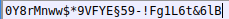

## Cover

<h3 align="center">
    <b>Praktikum Kemanan Jaringan</b> 
    A9 - Security Logging and Monitoring Failures (OWASP 10 Juice Shop)
</h3>
 

  

 

    Dosen Pembimbing: 
    Ferry Astika Saputra, S.T., M.Sc.

 

    Disusun Oleh: 
    Lula Rania Salsabilla (3122640045)
    Fifin Nur Rahmawati (3122640040)

 

    <b>
        KELAS D4 LJ IT B  
        JURUSAN D4 LJ TEKNIK INFORMATIKA  
        DEPARTEMEN TEKNIK INFORMATIKA DAN KOMPUTER   
        POLITEKNIK ELEKTRONIKA NEGERI SURABAYA  
        2023
    </b>

 

# Laporan

A9 - Security Logging and Monitoring Failures adalah kategori kerentanan keamanan yang terkait dengan kegagalan dalam melakukan logging dan monitoring kegiatan yang terjadi dalam suatu sistem atau aplikasi. Kerentanan ini dapat mengakibatkan ketidakmampuan untuk mendeteksi, melacak, dan merespons ancaman keamanan secara efektif. 

1. Kerentanan ini terjadi ketika sistem tidak melakukan pencatatan (logging) kegiatan yang relevan dan penting untuk pemantauan keamanan. Hal ini membuat sulit untuk mengetahui apa yang terjadi di dalam sistem, termasuk serangan yang terjadi atau aktivitas mencurigakan.

2. Jika log keamanan tidak dilindungi dan tidak diamankan dengan baik, penyerang dapat mengubah atau menghapus log untuk menyembunyikan jejak serangan atau aktivitas yang mencurigakan.

3. Jika sistem tidak dilengkapi dengan mekanisme pemantauan real-time, maka aktivitas yang mencurigakan atau serangan yang sedang berlangsung tidak akan segera terdeteksi, memberikan peluang lebih besar bagi penyerang untuk melakukan kerusakan atau pencurian data.

4. Jika log keamanan tidak lengkap atau tidak memadai, akan sulit untuk melacak dan menyelidiki insiden keamanan yang terjadi. Hal ini dapat menghambat respons dan penanganan insiden yang efektif.

5. Jika log keamanan tidak diintegrasikan dengan alat analisis yang memadai, maka informasi yang berharga untuk mengidentifikasi ancaman keamanan dapat terlewatkan. Integrasi dan analisis log yang baik dapat membantu mengidentifikasi pola serangan, memprediksi ancaman potensial, dan meningkatkan kecepatan respons terhadap insiden.

6. Jika sistem tidak dilengkapi dengan mekanisme notifikasi dan tanggapan otomatis, maka serangan atau aktivitas mencurigakan tidak akan segera mendapatkan perhatian dan tindakan yang diperlukan, meningkatkan risiko kerugian yang lebih besar.

Untuk mengatasi kerentanan A9 - Security Logging and Monitoring Failures, dapat menerapkan praktik logging dan monitoring yang baik dalam sistem, termasuk pencatatan kegiatan yang relevan, perlindungan log dari manipulasi atau penghapusan yang tidak sah, dan pemantauan real-time untuk mendeteksi aktivitas mencurigakan. 

Selain itu, mengintegrasikan log keamanan dengan alat analisis yang memadai, menerapkan mekanisme notifikasi dan tanggapan otomatis, dan memiliki prosedur yang jelas untuk melacak dan menyelidiki insiden keamanan. Dengan demikian, organisasi dapat meningkatkan kemampuan mereka dalam mendeteksi, melacak, dan merespons ancaman keamanan dengan lebih efektif.

Dalam percobaan kali ini, kali mencoba 2 percobaan yaitu :

1. Mengakses access log file dari server (masuk ke dalam CWE-532 dikarenakan file penting dari server dapat diakses oleh penyerang)
2. Login dengan username yang benar dengan menggunakan password yang didapatkan dari file access log yang sudah tersebar. (masuk ke dalam CWE-778 dikarenakan percobaan login berulangkali dengan kesalahan username dan password tidak dihiraukan dan tetap bisa memasukkan username dan password yang lainnya).

**A. PERCOBAAN MENDOWNLOAD FILE ACCESS LOG**

1. Masuk ke website aplikasi Juice Shop  
     
2. Gunakan FFUF untuk fuzzing 
   Fuzzing merupakan proses pengujian software yang melibatkan pengiriman input yang tidak valid, acak, atau tidak terduga ke aplikasi target. Fuzzing bertujuan untuk menemukan kelemahan atau kerentanan yang dapat dieksploitasi  
     
   FFUF digunakan untuk fuzzing url, parameter, wordlist generator, filter response, dan pemetaan aplikasi web. Berikut adalah contoh FFUF:  
     

3. Jalankan perintah FFUF 
   Menjalankan perintah  
   ffuf -w /usr/share/wordlists/dirb/common.txt -u http://localhost:3000/FUZZ  
     
   Didapatkan status 200 dengan ukuran 1987. Berikut adalah penerapan salah satu string pada browser  
     
   Didapatkan halaman berupa list produk. 

4. Fuzzing url dengan menambah perintah -fs 
   Dilakukan perintah -fs 1987 untuk menampilkan feedback selain ukuran 1987 
     
   Didapatkan hasil bahwa assets dan ftp memiliki ukuran yang masing-masingnya adalah 179 dan 11062. Kemudian coba pada url browser:  
   <  
    

5. Mencari url yang mengandung /support  
   
   Didapatkan string Logs dan jalankan pada browser kemudian save file  
     
   Buka file  
     
   File ini berisi informasi penting mengenai aktivitas akses ke sistem dan tidak seharusnya dapat diakses bahkan diunduh oleh sembarang orang karena bersifat sensitif dan rahasia.
6. Berhasil menyelesaikan challenge access log 
   Kembali ke halaman Juice Shop dan terdapat notifikasi challenge berhasil dilakukan
    

**B. PERCOBAAN LOGIN DENGAN USERNAME DAN PASSWORD REAL**

1. Dump file di inernet
   Mencari file access log aplikasi Juice Shop di web browser. 
     
   Pada access log terdapat aktivitas mengganti password dengan metode GET dan dapat diketahui bahwa password yang lama adalah: 
     
   Pada password, diketahui %C2%A7 yang dimungkinkan bahwa password sudah di encode. Maka darinya diperlukan decode:
     
     
   Berikut adalah hasil decode password:  
     

2. Login admin untuk mengetahui list email user 
   Masuk ke user admin dengan SQL Injection. Kemudian tuju halaman /administration. 
     
     

3. Mencocokan username dan password menggunakan burp-suite 
   Masukkan list email yang didapatkan pada username.txt 
     
   Mencari HTTP history dan mengirimkan ke intruder 
     
   Pada intruder, buat email menjadi variabel dengan menambah simbol $ 
     
   Pada tabs payload, inputkan file username.txt di simple list 
     
   Didapatkan hasil bahwa tidak ada response 200. Hal ini mungkin disebabkan oleh password yang berisi karakter $ 
     

4. Mencoba mencocokkan secara manual 
   Masuk ke halaman login dan mencoba satu-satu email yang ada pada username.txt 
     
   Didapatkan hasil email yang memiliki password tersebut adalah alamat email J12934@juice-sh.op 
     
