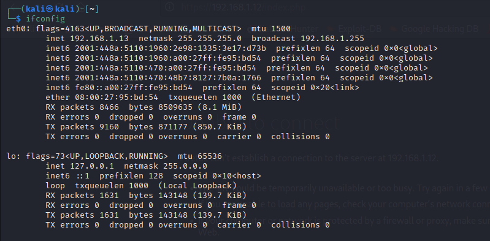
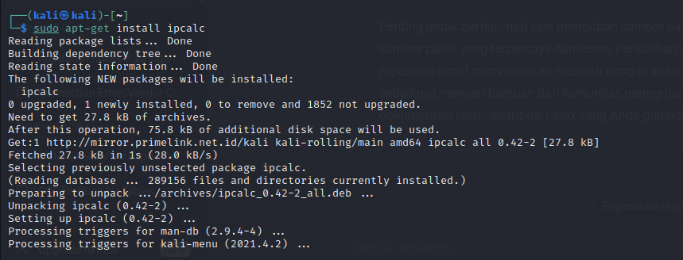
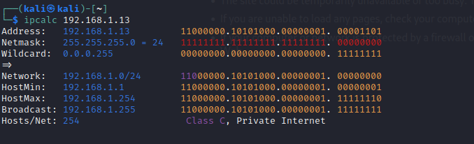
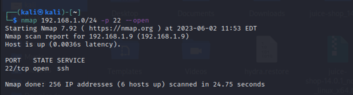
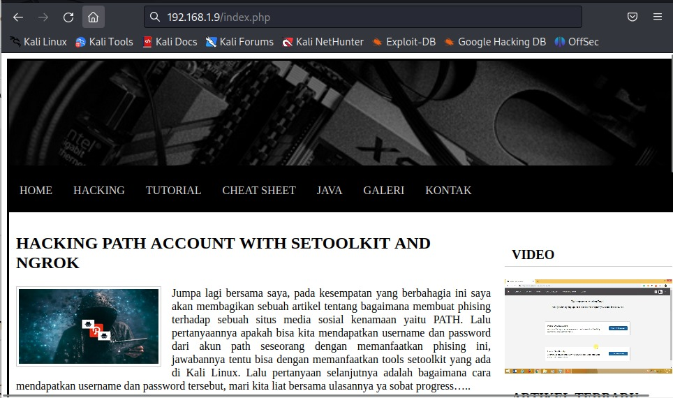
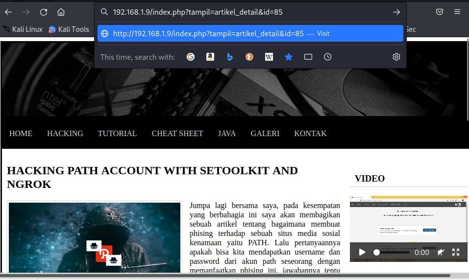

## Cover

<h3 align="center">
    <b>Praktikum Kemanan Jaringan</b><br>
   Attack Scenario
</h3>
<br>
<p align="center">
  
</p>
<br>
<p align="center">
    Dosen Pembimbing:<br>
    Ferry Astika Saputra, S.T., M.Sc.
</p>
<br>
<p align="center">
    Disusun Oleh:<br>
    Lula Rania Salsabilla (3122640045)
</p>
<br>
<p align="center">
    <b>
        KELAS D4 LJ IT B <br>
        JURUSAN D4 LJ TEKNIK INFORMATIKA <br>
        DEPARTEMEN TEKNIK INFORMATIKA DAN KOMPUTER <br> 
        POLITEKNIK ELEKTRONIKA NEGERI SURABAYA <br>
        2023
    </b>
</p>
<br>


## Laporan

Melakukan praktikum dengan cara melakukan upaya peretasan pada VDI Ubuntu. Dengan tujuan dapat berhasil mengakses database dengan menggunakan sqlmap dan mendapatkan user root dengan menggunakan hydra. 

**SQLmap** 
SQLmap adalah sebuah tools yang digunakan untuk melakukan penetration testing ke sebuah webiste dengan mengexploitasi variabel yang terdapat pada sebuah website, baik yang dikirimkan melalui metode POST ataupun GET. Teknik hacking yang menggunakan SQLmap ini dinamakan SQLInjection. [[1](https://www.rumahcode.org/74/Tutorial-SQLmap)].

**Hydra**
Hydra merupakan salah satu tool cracking password yang sangat populer di kalangan pentester, hal ini karena hydra mampu melakukan cracking password dengan cukup cepat dan juga mendukung banyak protokol. Tool ini merupakan tool yang didesain khusus untuk melakukan cracking password dengan metode brute force [[2](https://www.tutorialjaringan.com/2019/07/tutorial-cara-cracking-password-router-dengan-hydra.html)].

Hydra is a brute-forcing tool that helps penetration testers and ethical hackers crack the passwords of network services. Hydra can perform rapid dictionary attacks against more than 50 protocols. This includes telnet, FTP, HTTP, HTTPS, SMB, databases, and several other services. Hydra was developed by the hacker group “The Hacker’s Choice”. Hydra was first released in 2000 as a proof of concept tool that demonstrated how you can perform attacks on network logon services. Hydra is also a parallelized login cracker. This means you can have more than one connection in parallel. Unlike in sequential brute-forcing, this reduces the time required to crack a password. [[3](https://www.freecodecamp.org/news/how-to-use-hydra-pentesting-tutorial/)].

**Brute force attack** 
Brute force attack adalah metode peretasan yang dilakukan menggunakan cara trial and error untuk memecahkan kata sandi, kredensial login, maupun kunci enkripsi. Istilah brute force sendiri mengacu kepada upaya paksa yang dilakukan secara berlebihan untuk mendapatkan akses ke suatu akun. Saat melakukan brute force attack, peretas akan mencoba beberapa nama pengguna dan kata sandi dengan bantuan komputer. Kemudian, menguji berbagai kombinasi nama dan kata sandi tersebut hingga menemukan informasi login yang benar. Cara ini tergolong sederhana jika dibandingkan dengan serangan siber lainnya. Namun, hingga saat ini brute force attack masih sering digunakan untuk mengambil-alih akun secara ilegal. [[4](https://www.dewaweb.com/blog/apa-itu-brute-force-attack/)].

### A. Mengambil Data Database Menggunakan sqlmap

1. Langkah pertama, melihat inet dengan menggunakan perintah ifconfig

    ```$ ifconfig```

    

2. Langkah selanjutnya kita memastikan apakah ipcalc sudah terinstall di kali linux 

    

3. Jalankan command berikut dan masukkan inet yang berhasil kita dapatkan pada langkah pertama

    ```$ ipcalc 192.168.1.13```

    

4. Langkah selanjutnya kita lakukan scanning network dengan menggunakan NMap untuk mendapatkan ip target yang akan kita serang dengan menggunakan ip network yang kita dapatkan dari menjalankan command ipcalc

    ```$ nmap 192.168.1.0/24 -p 22 --open```

    

5. Kemudian buka ip pada browser

     ```192.168.1.9/index.php```

     

6. Kemudian mencari halaman yang memerlukan id seperti dibawah ini

    

7. Menjalankan sqlmap dengan kode dibawah ini untuk melihat database yang ada

    ```sqlmap -u “Url” –dbs```

     
     

8. Menjalankan sqlmap dengan kode dibawah ini untuk melihat table pada database yang dimaksud

    ```sqlmap -u “url” -D vulnweb –tables```

     
     

9. Menjalankan sqlmap dengan kode dibawah ini untuk melihat daftar kolom pada tabel

    ```sqlmap -u “url” -T user –columns```

     
     

10. Menjalankan sqlmap dengan kode dibawah ini untuk melihat credential data user meliputi data id_user, password, dan username

    ```sqlmap -u “url” -C id_user,password,username –dump```

     
     

### B. Mencari tahu password root menggunakan Hydra (bruteforce attack)

1. Kita akan melakukan penyerangan pada ip 192.168.1.9. 

    ```$ nmap 192.168.1.0/24 -p 22 --open```

    

2. Berikutnya mencari tahu mengenai kumpulan username dan password dan melakukan download zip atau clone [repo berikut](https://github.com/duyet/bruteforce-database) untuk mendapatkan list username dan password yang akan kita gunakan untuk bruteforce

    

3. Kemudian melakukan copy paste file username.txt dan passwords.txt ke dalam folder /home/kali

    

4. Selanjutnya kita jalankan command Hydra untuk memulai proses bruteforcenya dengan menggunakan ip target 192.168.1.9

    ```$ hydra -L username.txt -P password.txt ssh://192.168.1.9```

    

    sayangnya pada step ini, proses bruteforce menggunakan Hydra belum mendapatkan hasil dengan proses sudah berjalan selama 18 jam. Mencoba password dengan besar 2 juta data dan 100 ribu data.