## Cover

<h3 align="center">
    <b>Praktikum Kemanan Jaringan</b> 
   Data Mining Using KNIME
</h3>
 

  

 

    Dosen Pembimbing: 
    Ferry Astika Saputra, S.T., M.Sc.

 

    Disusun Oleh: 
    Lula Rania Salsabilla (3122640045)

 

    <b>
        KELAS D4 LJ IT B  
        JURUSAN D4 LJ TEKNIK INFORMATIKA  
        DEPARTEMEN TEKNIK INFORMATIKA DAN KOMPUTER   
        POLITEKNIK ELEKTRONIKA NEGERI SURABAYA  
        2023
    </b>

 

## Laporan

<b><h3 align="center"> DATA MINING USING KNIME </h3></b> 

1.  Bagi File menjadi 5 bagian : init.pcap, init2.pcap, init3.pcap, init4.pcap, init5.pcap  
    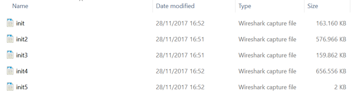 
2.  Kemudian buka file tersebut secara bergantian menggunakan Wireshark. Pada langkah ini kita gunakan file init.pcap  
    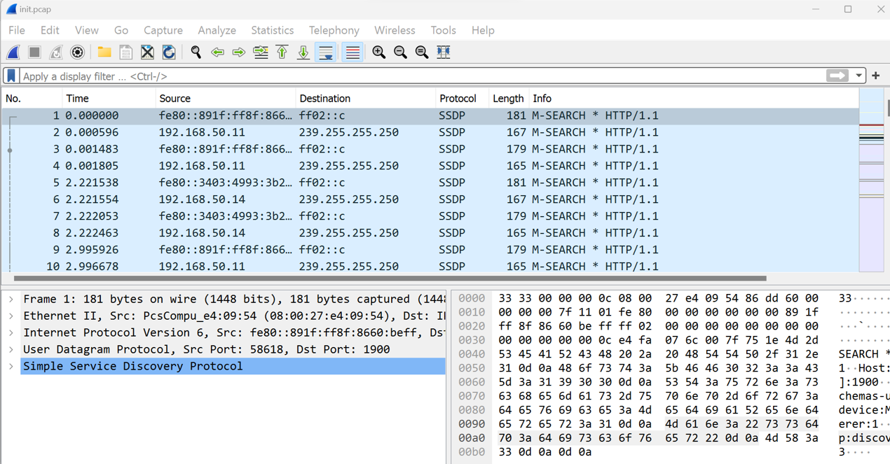 
3.  Untuk proses analisis yang akan dilakukan nantinya, kita akan mengambil data dengan ip versi 4 (ipv4) dan protocol TCP, DNS saja. Untuk proses tersebut dapat dilakukan pada wireshark menggunakan perintah ip.version==4 && tcp || dns pada kolom display filter tepat dibawah toolbar  
    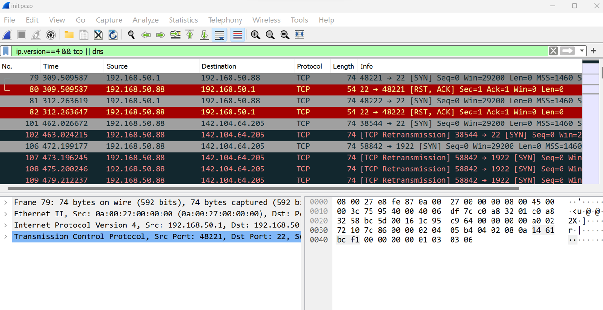 
4.  Untuk mendapatkan delta time dan delta time dan delta time display, klik Edit – Preferences – Column
    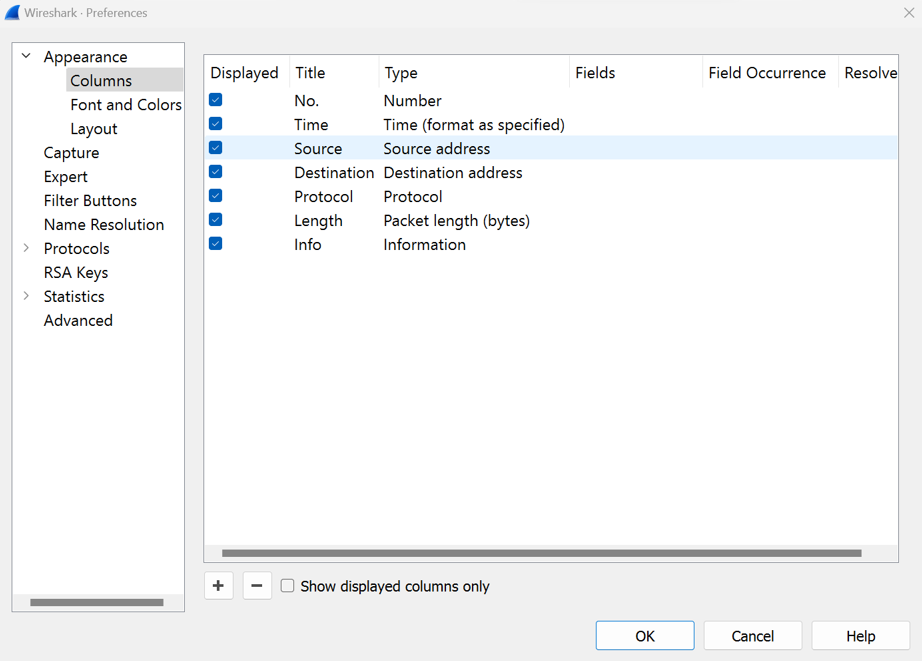 
    Hasilnya  
    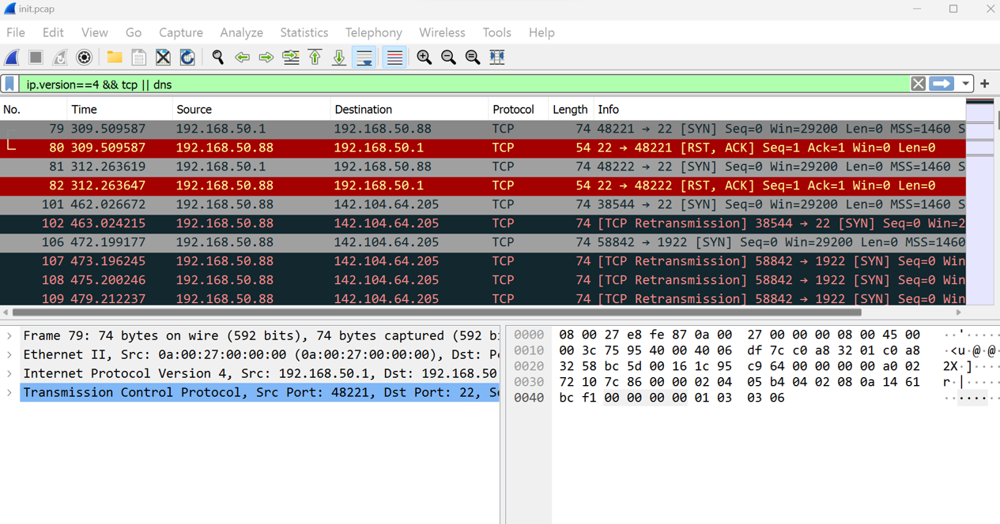 
5.  Export file pcap tersebut keformat Comma-separated Value (.csv) dengan cara klik File – Export Packet Dissections – As CSV. Yang perlu diperhatikan yaitu pada Pacet Range, pastikan yang terpilih yaitu Displayed, karena data pada Displayed ini sudah terfilter denga nip version 4  
    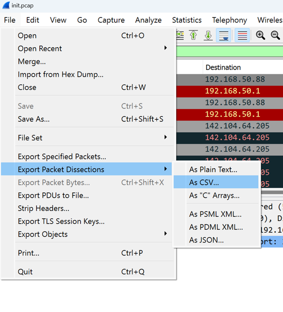 
    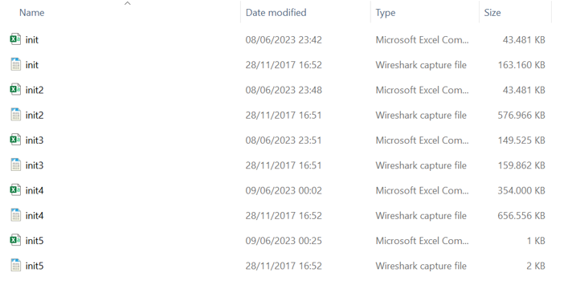 
6.  Membuat workflow/project baru. Dengan cara klik File – New – New Knime Workflow – Tulis Nama workflow dan Lokasi workflow tersebut – Klik Finish  
    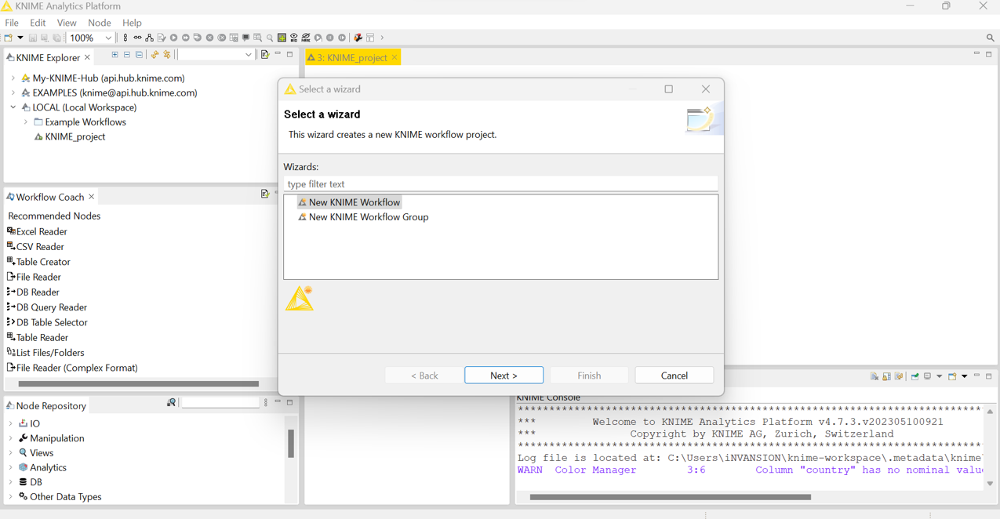 
7.  Tambahkan data ke dalam file reader  
    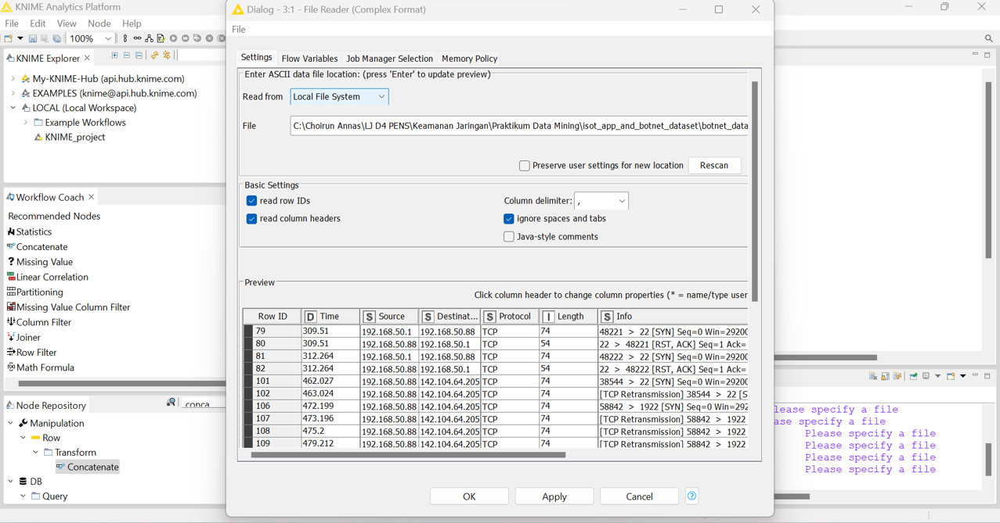 
8.  Gabungkan kelima data dengan menggunakan concatenate dan data reader seperti gambar di bawah  
    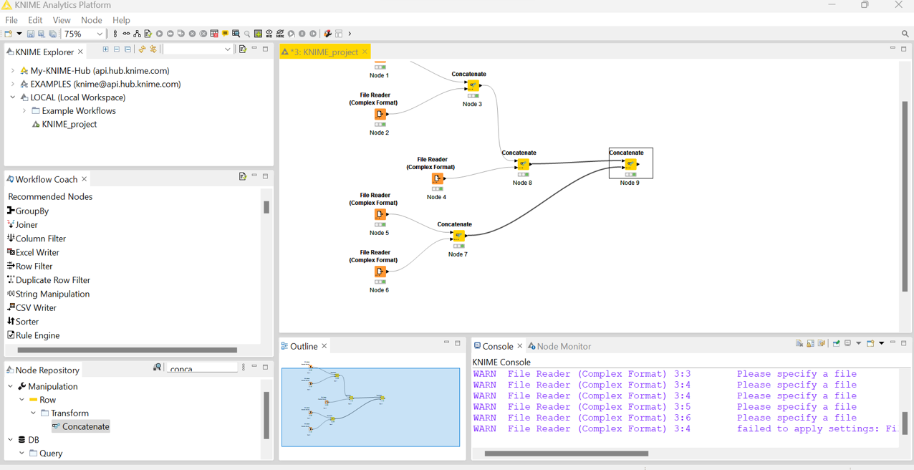 
9.  Untuk melakukan labeling data normal kita akan menggunakan Node Missing Value. Node ini digunakan untuk mengisi data kosong  
    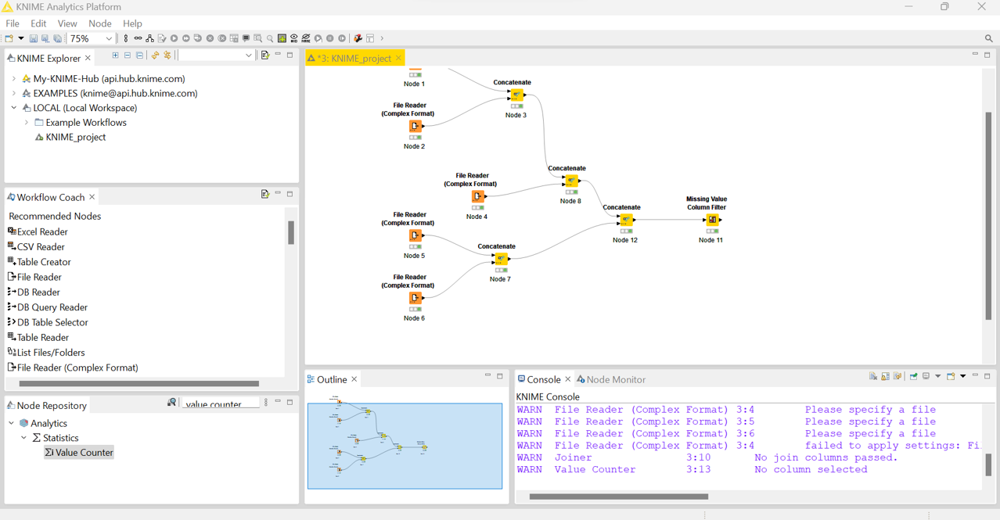 
10. Untuk memastikan bahwa kolom label sudah terisi dengan value Malicious atau Normal, dapat menggunakan node Value Counter. Node ini berfungsi untuk menghitung jumlah seluruh value pada kolom terpilih.  
    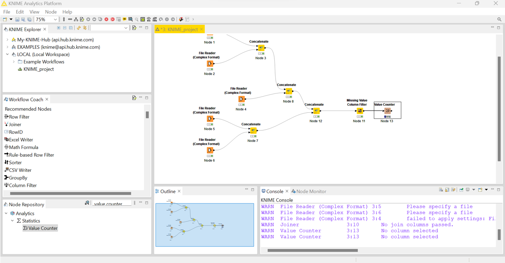 
11. Export file ke dalam format .csv dengan menggunakan node CSV Writer  
    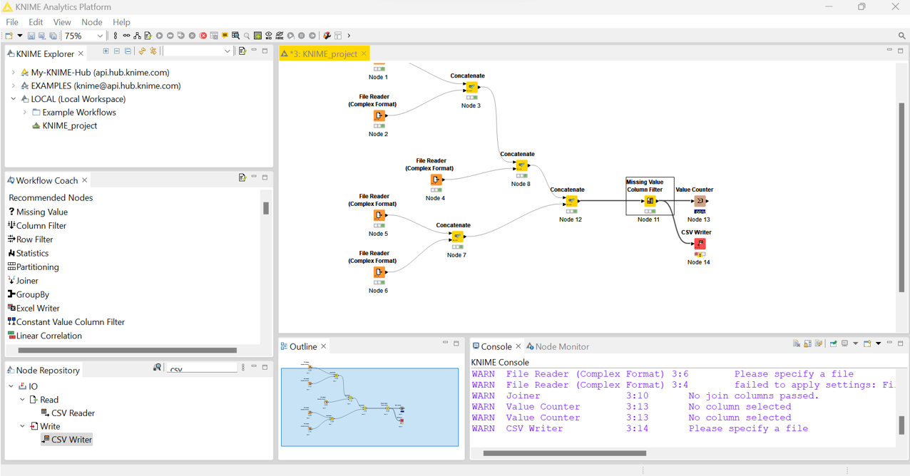 
    Data diletakkan di dalam file hasil.csv  
    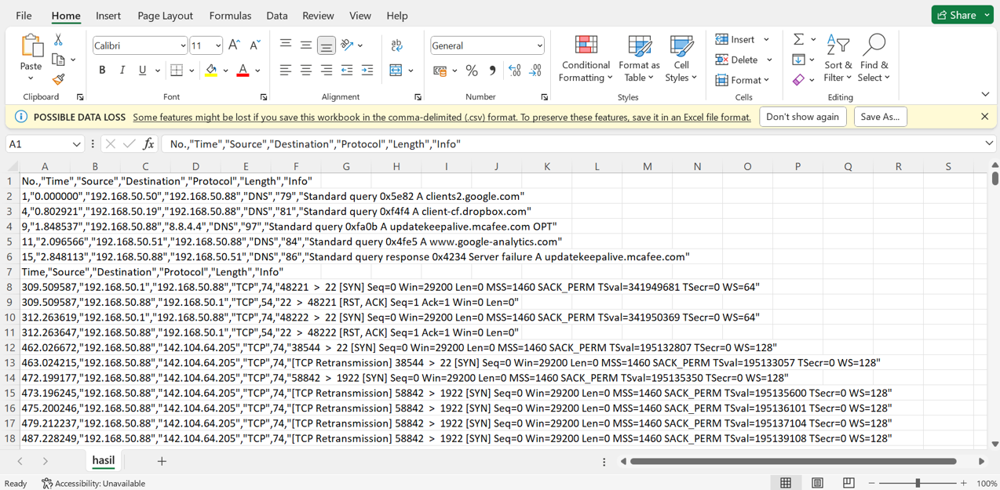 
12. Data pre-processing  
    Proses dimana data akan dibersihkan (cleaning) karena biasanya didalam suatu data terdapat nilai-nilai yang tidak sempurna atau bahkan terdapat nilai-nilai yang hilang atau kosong yang nantinya akan dapat mempengaruhi proses kedepannya. Pada proses ini kita membutuhkan Node-node berikut : File Reader, Column Filter, Missing Value.  
    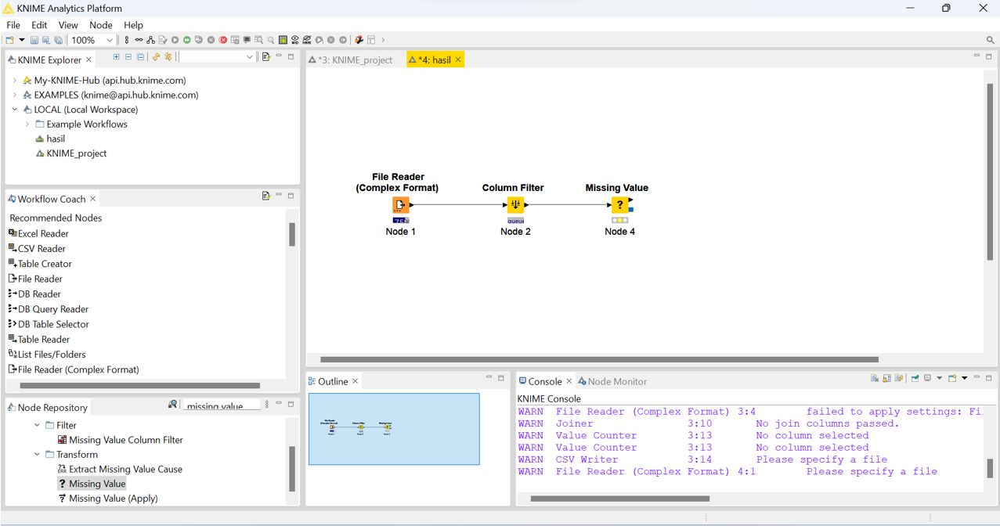 
13. Proses data transformation, pada proses ini data akan diubah ke format yang sesuai untuk proses data mining. Node yang digunakan pada tahap ini yaitu Normalizer. Berikut konfigurasinya:  
    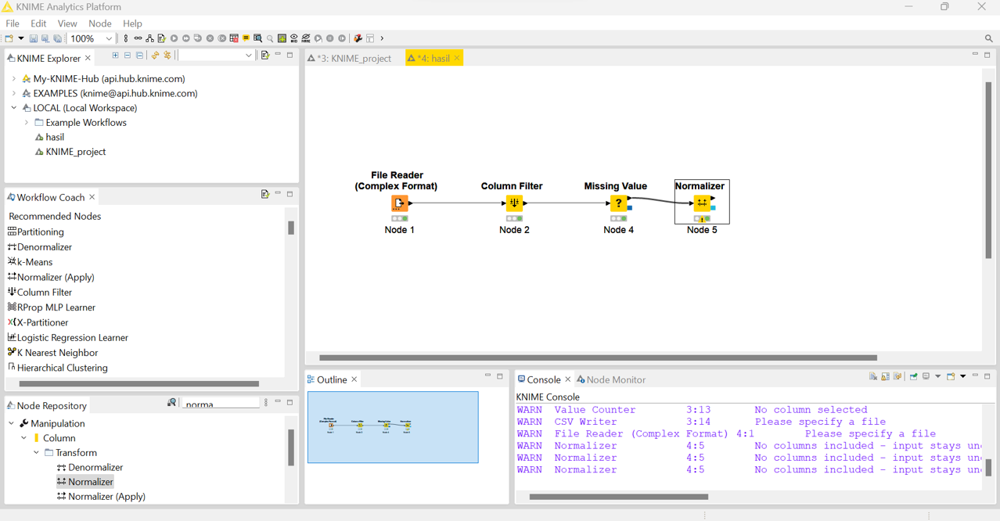 
14. Data Mining  
    Setelah menyelesaikan tahap data transformation, kita akan menjalankan proses Data Mining, dalam proses ini kita akan menggunakan Metode Klasifikasi Decision Tree dengan teknik Cross Validation. Pada proses ini kita membutuhkan Node-node berikut : X-Partitioner, Decision Tree Learner, Decision Tree Predictor, X-Aggregator Sehingga akan membentuk flow seperti ini  
    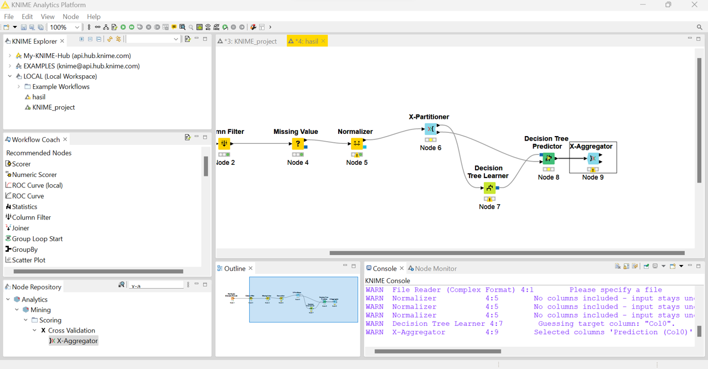 
15. Node Scorer yang didalamnya terdapat perhitungan untuk melihat seberapa baik model ini dengan menggunakan teknik confusion matrix. Berikut konfigurasinya.  
    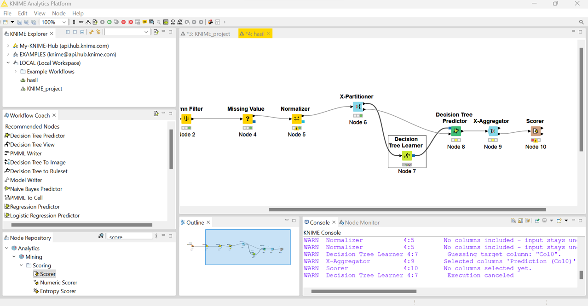 
16. Hasil prediksi  
    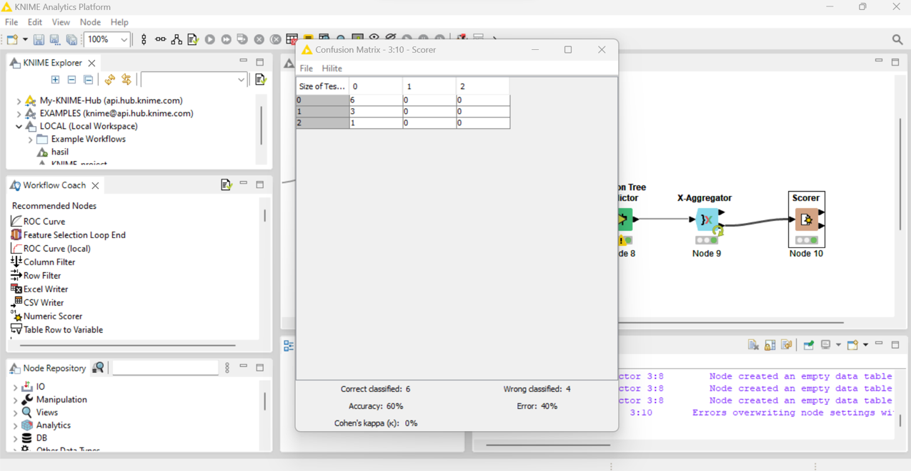 
